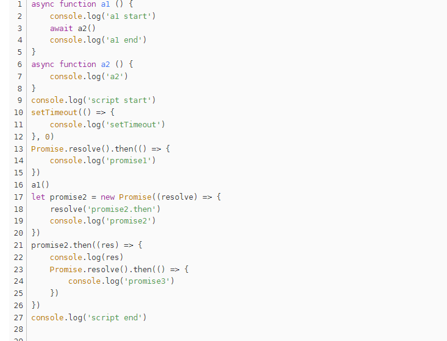
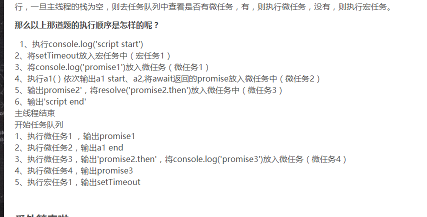

Promise **本质上是一个构造函数（new Promise()）**，用来封装一个异步操作并可以获取其结果，其结果在Promise对象创建时可能是未知的。

它允许你为异步操作的成功和失败分别绑定相应的处理方法。 这让异步方法可以像同步方法那样返回值，但并不是立即返回最终执行结果，而是一个能代表未来出现的结果的promise对象；

## 基本特征

1. **Promise 有三个状态且不可逆：**pending，fulfilled，rejected，默认状态是 pending，状态一旦确认，就不会再改变；
2. new Promise 时， 需要传递一个 executor（）执行器，**执行器立即执行**，executor 接收两个参数，分别是 resolve 和 reject；
3. Promise  有一个 value 保存成功状态的值，可以是 undefined/thenable/promise；有一个 reason 保存失败状态的值；
4. Promise 必须有一个 then 方法，then 接收两个参数，分别是 promise 成功的回调 onFulfilled 和 promise 失败的回调 onRejected；

   -  onFufilled 和 onRejected 可以缺省，如果 onFufilled 和 onRejected 不是函数就将其忽略，依旧可以在后面的 then 中获取到之前返回的值；


5. Promise  可以 then 多次，每次执行完 Promise.then 方法后返回的都是一个新的 Promise ；

- then 的返回值是一个普通值，就会把这个结果作为参数，传递给下一个 then 的成功回调中；
- then 中报出了异常，就会把这个异常作为参数，传递给下一个 then 的失败回调中；
- then 的返回值是一个 Promise，那么会等这个 Promise  执行完，Promise  如果成功就走下一个 then 的成功否则就走下一个 then 的失败，如果抛出异常，也走下一个 then 的失败；
- then 的返回值和 Promise 是同一个引用对象，造成循环引用，则抛出异常，把异常传递给下一个 then 的失败的回调中；
-  then 的返回值是一个 Promise，且值同时调用 resolve 函数和 reject 函数，则第一次调用优先，其他所有调用被忽略；

## 调用流程

1. Promise 的构造方法接收一个executor( )，在 new Promise( )时就**立刻执行**这个executor( )回调；
2. executor( )内部的异步任务被放入宏 / 微任务队列，等待执行；
3. then( )被执行，收集成功/失败回调，放入成功/失败队列；
4. executor( )的异步任务被执行，触发resolve/reject，从成功/失败队列中取出回调依次执行；

   - Promise 中**只有涉及了状态变更后才需要被执行的回调才算是微任务**，例如 then、catch、finally，其它所有的代码执行都是宏任务（同步执行）；
   - 链式调用中，只有前一个 then 的回调执行完毕后，跟着的 then 中的回调才会被加入至微任务队列 ；


## API方法

### Promise.prototype.catch

用来捕获 promise 的异常，相当于一个没有成功的 then；

```javascript
Promise.prototype.catch = function(errCallback){
  return this.then(null,errCallback)
}
```

### Promise.resolve

返回一个状态由给定value决定的Promise对象；


### Promise.reject

返回一个失败的promise对象；

```javascript
static reject(reason){
  return new Promise((resolve,reject)=>{
    reject(reason);
  })
}
```

### Promise.all

返回一个新的promise, 只有所有的promise都成功才成功, 只要有一个失败了就直接失败；

```javascript
Promise.all = function(values) {
  // .......  
  return new Promise((resolve, reject) => {
    let resultArr = [];
    let orderIndex = 0;
    // 根据索引往结果数组放值
    const processResultByKey = (value, index) => {
      resultArr[index] = value;
      if (++orderIndex === values.length) {
          resolve(resultArr)
      }
    }
    for (let i = 0; i < values.length; i++) {
      let value = values[i];
      if (value && typeof value.then === 'function') {
        // 返回的是thenable，执行then方法
        value.then((value) => {
          processResultByKey(value, i);
        }, reject);
      } else {
        processResultByKey(value, i);
      }
    }
  });
}
```

### Promise.race

返回一个新的promise, 第一个完成的promise的结果状态就是最终的结果状态；

```javascript
// 实现时不用考虑第一个，直接for循环，谁先异步执行完成resolve，记住Promise状态改变时不可逆的
Promise.race = function(promises) {
  return new Promise((resolve, reject) => {
    for (let i = 0; i < promises.length; i++) {
      let val = promises[i];
      if (val && typeof val.then === 'function') {
        val.then(resolve, reject); // 传入的值是promise，执行.then结果
      } else {
        resolve(val)
      }
    }
  });
}
```

### Promise.any

接收一个Promise对象的集合，当其中的一个promise 成功，就返回那个成功的promise的值；

### Promise.allSettled

-  等到所有promises都完成（每个promise返回成功或失败）；
- 返回一个promise，该promise在所有promise完成后完成，并带有一个对象数组，每个对象对应每个promise的结果；

### Promise.prototype.finally

1. 如果返回一个 promise 会等待这个 promise 也执行完毕；
2. 如果返回的是成功的 promise，会采用上一次的结果；
3. 如果返回的是失败的 promise，会用这个失败的结果，传到 catch 中

```javascript
Promise.prototype.finally = function(callback) {
  return this.then((value)=>{
    return Promise.resolve(callback()).then(()=>value)
  },(reason)=>{
    return Promise.resolve(callback()).then(()=>{throw reason})
  })  
}
```

## Async 与 Await

async 函数就是 **generator 函数的语法糖**：就是将 generator 函数的 * 换成 async ，将 yield 替换成 await，

async...await 函数对 generator 的改进，感觉它的出现是为了优化.then()链的写法的

- 内置执行器，不需要使用 next() 手动执行
- await 命名后面可以是 Promise 对象或者原始类型的值，yield命令后面只能是Thunk函数或Promise对象
- 返回值是 Promise ，返回非 Promise 时，async 函数会把它包装成 Promise 返回：`Promise.resolve(value)`

### async 函数

async 函数用来声明一个函数是异步的，返回一个 Promise 对象（就是是内部函数返回一个字符串，也会用promise.resolve()封装的）；

Promise 对象的结果由async函数执行的返回值决定；

### await 表达式

- await 右侧的表达式一般为 Promise 对象，但也可以是其它的值 ；

  - 如果表达式是 Promise 对象，await 返回的是 Promise 成功的值；
  - 如果表达式是其它的值，直接将此值作为 await 的返回值 ；

- await 必须写在 async 函数中, 但 async 函数中可以没有 await；
- 如果 await 的 Promise 失败了, 就会抛出异常,可以通过 **try...catch 来捕获处理**；

## 关键问题

### promise 怎么捕获错误

**try...catch 方法是同步的，所以只能捕获同步代码的错误**

- 如果我们需要捕获 Promise 的错误，需要使用 promise-catch 方法来捕获（**记得我们前面说过promise所有需要等待状态变更的方法都是微任务，除了这些方法剩下的代码才是同步的）**
- 如果使用 async await，可以使用 try-catch 来捕获错误（因为这个时候时同步代码）
- 在Promise 设计中，**executor 默认有个try...catch，有异常时内部已经捕获了，并且将其封装成 reject 状态**的 promise ，可以通过 Promise.catch 方法来捕获

  ```javascript
  console.log(1)
  new Promise((resolve) => {
    console.log(2)
    throw Error(4)
  }).then((e) => { console.log(e) })
  console.log(3)
  
  // 上面的代码log顺序是 1234，异常4在promise内部已经捕获错误放到reject里面了，是微任务
  ```


```javascript
try {
    new Promise((resolve,reject)=>{
        throw Error('promise 内部错误1')
    }).catch(e=>{
        console.error('promise catch 错误')  // 能捕获错误
    })
} catch (e) {
    console.error('try catch 错误', e) // 捕获不到错误
}

new Promise(r=>{
    try{
      throw Error('promise 内部错误2')
    } catch(e){
      console.warn(e) // 能捕获错误
	}
})


// 使用 async await 捕获
async function getData(){
  throw new Error('error')
}
async function test(){
  try{
    const value = await getData()
  } catch (error){
    console.error(error)  // 能捕获错误
  }
}
```

### 异常传透

当使用 Promise 的 then 链式调用时, 可以在最后指定失败的回调；所以前面任何操作出了异常, 都会传到最后失败的回调中处理；

但如果要**中断 Promise 链**：在回调函数中返回一个pending 状态的Promise 对象；

### 为什么要使用Promise

1. **指定回调函数的方式更加灵活：**

   - 旧的：必须在启动异步任务前指定；
   - promise： 启动异步任务、返回promie对象 、 给promise对象绑定回调函数(甚至可以在异步任务结束后指定)，无论何时查询，都能得到这个状态（主要还是promise状态不可逆，什么时候调用都能拿到状态）；

2. **支持链式调用, 可以解决回调地狱问题：**

   - 回调地狱的缺点：不便于阅读 / 不便于异常处理；
   - 解决方案：promise链式调用；终极解决方案：async/await；


### then()返回的新promise的结果

由then()指定的回调函数执行的结果决定；

1. 如果抛出异常, 新promise变为rejected, reason为抛出的异常；
2. 如果返回的是非promise的任意值, 新promise变为resolved, value为返回的值；
3. 如果返回的是另一个新promise, 此promise.then的结果就会成为新promise的结果；

##### promise、async和await在事件循环中的执行过程






### promise缺点

- Promise 一旦新建（new Promise）就会立即执行，无法中途取消；
- 如果不设置回调函数，Promise 内部的错误就无法反映到外部；
- 当处于pending状态时，无法得知当前处于哪一个状态，是刚刚开始还是刚刚结束

## 应用场景

### 加载图片

```javascript
function loadImg(url){s
  return new Promise((resolve, reject) => {
    var imgDom = document.createElement("img");
    imgDom.src = url;
    imgDom.onload = ()=>{
      resolve(imgDom);  //图片加载成功回调
    }
    imgDom.onerroe = (error)=>{
      reject(error) //图片加载失败回调
    }
    document.body.appendChild(imgDom);
  })
}
const url = "https://xxx.com/test.jpg";
loadImg(url).then(res=>{d h yy y y s z x x  console.log(res.width);
}, error=>{
  console.log(error)
})
```

### 原生XHR请求

```javascript
function promiseGet(url) {
    return new Promise((resolve, reject)=>{
      const xhr = new XMLHttpRequest();
      xhr.open('GET', url, true);
      xhr.send();
      xhr.onreadystatechange = function () {
        if(xhr.readyState === 4){
          if(xhr.status===200){
            resolve(xhr.response);
          }
        }
      }
      xhr.onerror = ()=>{
        reject(xhr.response);
      }
      xhr.upload.onprogress = function (e) {
       const percent = (e.loaded / e.total) * 100;
       console.log("percent: " + percent)
      }
    })
}
const url = "https://xxx.com/test.jpg";
promiseGet(url).then(res=>{
  console.log(res);
}).catch(error=>{
  console.log("error...", error)
})
```

## 实现一个Promise

### 基础版

没有考虑 proimse.then().then() 的情况；

```javascript
// 三个状态：PENDING、FULFILLED、REJECTED
const PENDING = "pending";
const FUFILLED = "fufilled";
const REJECTED = "rejected";

class Promisee {
  constructor(executor) {
    this.status = PENDING; // 默认状态为 PENDING
    
    // 两个结果
    this.value = undefined; // 存放成功状态的值，默认为 undefined
    this.reason = undefined; // 存放失败状态的值，默认为 undefined

    // 两个回调
    this.onResolvedCallbacks = []; // 存放成功的回调
    this.onRejectedCallbacks = []; // 存放失败的回调

    // 调用此方法就是成功
    let resolve = (value) => {
      // 状态为 PENDING 时才可以更新状态，防止 executor 中调用了两次 resovle/reject 方法
      if (this.status === PENDING) {
        this.status = FUFILLED;
        this.value = value;

        // 依次将对应的函数执行
        this.onResolvedCallbacks.forEach((fn) => fn(value));
      }
    };
    
    // 调用此方法就是失败
    let reject = (reason) => {
      // 状态为 PENDING 时才可以更新状态，防止 executor 中调用了两次 resovle/reject 方法
      if (this.status === PENDING) {
        this.status = REJECTED;
        this.reason = reason;

        // 依次将对应的函数执行
        this.onRejectedCallbacks.forEach((fn) => fn(reason));
      }
    };

    try {
      // 立即执行，将 resolve 和 reject 函数传给使用者
      executor(resolve, reject);
    } catch {
      // 发生异常时执行失败逻辑
      reject(error);
    }
  }

  // 包含一个 then 方法，并接收两个参数 onFulfilled、onRejected
  then(onFulfilled, onRejected) {
    // Promise 已经成功
    if (this.status === FUFILLED) {
      onFulfilled(this.value);
    }
    // Promise 已经失败
    if (this.status === REJECTED) {
      onRejected(this.reason);
    }

    // Promise的状态是 pending，需要将 onFulfilled 和 onRejected 函数存放起来，等待状态确定后，再依次将对应的函数执行
    if (this.status === PENDING) {
      this.onResolvedCallbacks.push(() => {
        onFulfilled(this.value);
      });
      this.onRejectedCallbacks.push(() => {
        onRejected(this.reason);
      });
    }
  }
}
```

### 升级版

```javascript
(function (window) {
  const PENDING = "pending";
  const RESOLVED = "resolved";
  const REJECTED = "rejected";

  function Promise(excutor) {
    const self = this; // 将当前promise对象保存起来
    self.status = PENDING; // promise默认状态为 PENDING
    self.data = undefined; // 给promise对象指定一个用于存储结果数据的属性

    self.callbacks = []; // 存放回调的结构: { onResolved() {}, onRejected() {}}

    // 调用此方法就是成功
    function resolve(value) {
      if (self.status !== PENDING) return; // 状态为 PENDING 时才可以更新状态，防止多次更新状态

      self.status = RESOLVED; // 将状态改为resolved
      self.data = value; // 保存value数据

      // 如果有待执行callback函数, 立即异步执行回调函数onResolved
      if (self.callbacks.length > 0) {
        setTimeout(() => {
          // 放入队列中执行所有成功的回调
          self.callbacks.forEach((calbacksObj) => {
            calbacksObj.onResolved(value);
          });
        });
      }
    }

    // 调用此方法就是失败
    function reject(reason) {
      if (self.status !== PENDING) return; // 状态为 PENDING 时才可以更新状态，防止多次更新状态

      self.status = REJECTED; // 将状态改为rejected
      self.data = reason; // 保存value数据

      // 如果有待执行callback函数, 立即异步执行回调函数onRejected
      if (self.callbacks.length > 0) {
        setTimeout(() => {
          // 放入队列中执行所有失败的回调
          self.callbacks.forEach((calbacksObj) => {
            calbacksObj.onRejected(reason);
          });
        });
      }
    }

    // 立即同步执行excutor
    try {
      excutor(resolve, reject);
    } catch (error) {
      // 如果执行器抛出异常, promise对象变为rejected状态
      reject(error);
    }
  }

  // Promise原型对象的then(),指定成功和失败的回调函数,返回一个新的promise对象,返回promise的结果由onResolved/onRejected执行结果决定
  Promise.prototype.then = function (onResolved, onRejected) {
    const self = this;
    // 指定回调函数的默认值(必须是函数)
    onResolved =
      typeof onResolved === "function" ? onResolved : (value) => value;
    onRejected =
      typeof onRejected === "function"
        ? onRejected
        : (reason) => {
            throw reason;
          };

    // 返回一个新的promise
    return new Promise((resolve, reject) => {
      // 执行指定的回调函数,根据执行的结果改变return的promise的状态/数据
      function handle(callback) {
        // 返回promise的结果由onResolved / onRejected执行结果决定;
        // 1. 抛出异常, 返回promise的结果为失败, reason为异常
        // 2. 返回的是promise, 返回promise的结果就是这个结果
        // 3. 返回的不是promise, 返回promise为成功, value就是返回值
        try {
          const result = callback(self.data);
          if (result instanceof Promise) {
            // 返回的是promise, 返回promise的结果就是这个结果
            result.then(
              (value) => resolve(vlaue),
              (reason) => reject(reason)
            );
          } else {
            // 返回的不是promise, 返回promise为成功, value就是返回值
            resolve(result);
          }
        } catch (error) {
          reject(error);
        }
      }

      if (self.status === RESOLVED) {
        // 当前promise的状态是resolved,立即异步执行成功的回调函数
        setTimeout(() => {
          handle(onResolved);
        });
      } else if (self.status === REJECTED) {
        // 当前promise的状态是rejected,立即异步执行失败的回调函数
        setTimeout(() => {
          handle(onRejected);
        });
      } else {
        // 当前promise的状态是pending,将成功和失败的回调函数保存callbacks容器中缓存起来
        self.callbacks.push({
          onResolved(value) {
            handle(onResolved);
          },
          onRejected(reason) {
            handle(onRejected);
          },
        });
      }
    });
  };

  // Promise原型对象的catch(),指定失败的回调函数,返回一个新的promise对象;
  Promise.prototype.catch = function (onRejected) {
    return this.then(undefined, onRejected);
  };

  // 返回一个指定结果的成功的promise;
  Promise.resolve = function (value) {
    // 返回一个成功/失败的promise
    return new Promise((resolve, reject) => {
      if (value instanceof Promise) {
        // 使用value的结果作为promise的结果
        value.then(resolve, reject);
      } else {
        // value不是promise  => promise变为成功, 数据是value
        resolve(value);
      }
    });
  };

  // 返回一个指定reason的失败的promise
  Promise.reject = function (reason) {
    // 返回一个失败的promise
    return new Promise((resolve, reject) => {
      reject(reason);
    });
  };

  // 返回一个promise, 只有当所有proimse都成功时才成功, 否则只要有一个失败的就失败
  Promise.all = function (promises) {
    const values = new Array(promises.length); // 保存所有成功value的数组
    let resolvedCount = 0; // 保存成功promise的数量
    return new Promise((resolve, reject) => {
      // 遍历promises获取每个promise的结果
      promises.forEach((p, index) => {
        Promise.resolve(p).then(
          (value) => {
            resolvedCount++; // 成功的数量加1
            values[index] = value; // 将成功的vlaue保存vlaues
            // 如果全部成功了, 将return的promise改变成功
            if (resolvedCount === promises.length) {
              resolve(values);
            }
          },
          (reason) => {
            // 只要一个失败了, return的promise就失败
            reject(reason);
          }
        );
      });
    });
  };

  // 返回一个promise, 其结果由第一个完成的promise决定
  Promise.race = function (promises) {
    return new Promise((resolve, reject) => {
      // 遍历promises获取每个promise的结果
      promises.forEach((p, index) => {
        Promise.resolve(p).then(
          (value) => {
            // 一旦有成功了, 将return变为成功
            resolve(value);
          },
          (reason) => {
            // 一旦有失败了, 将return变为失败
            reject(reason);
          }
        );
      });
    });
  };

  // 返回一个promise对象, 它在指定的时间后才确定结果
  Promise.resolveDelay = function (value, time) {
    return new Promise((resolve, reject) => {
      setTimeout(() => {
        if (value instanceof Promise) {
          // 使用value的结果作为promise的结果
          value.then(resolve, reject);
        } else {
          // value不是promise  => promise变为成功, 数据是value
          resolve(value);
        }
      }, time);
    });
  };

  // 返回一个promise对象, 它在指定的时间后才失败
  Promise.rejectDelay = function (reason, time) {
    // 返回一个失败的promise
    return new Promise((resolve, reject) => {
      setTimeout(() => {
        reject(reason);
      }, time);
    });
  };

  // 向外暴露Promise函数
  window.Promise = Promise;
})(window);
```