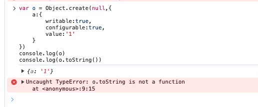
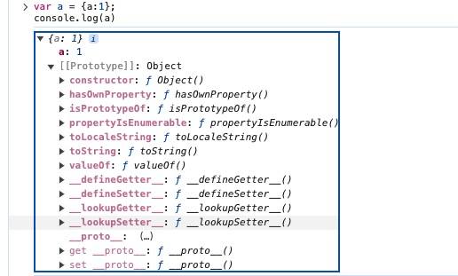

## new Object()

先创建空 Object 对象再动态添加属性

```javascript
var p = new Object()
p = {}
p.name = 'Tom'
p.age = 12
p.setName = function (name) {
  this.name = name
}
p.setaAge = function (age) {
  this.age = age
}
```

## 对象字面量模式

使用 {  } 创建对象同时指定属性 / 方法，这种很适合在不需要方法和原型的情况下快速创建简单的对象，**用来配置数据、存储数据和初始化刚开始就已经确定对象内部数据的情况**

```javascript
var obj = {
  name: 'Tom',
  age: 23,
  setName: function (name) {
    this.name = name
  }
}
```

## 工厂模式（函数封装）

用函数来封装创建对象的细节，达到调用函数动态创建对象并返回；这种比较适合需要创建多个类型的实力对象；我比较喜欢用这个来初始化表单数据

- 但是创建的对象无法和某个类型联系起来（可以理解为这种方式只是起到了封装的作用，没有建立起对象和类型的关系），因为所有的实例都指向一个原型，都是 Object 类型；

```javascript
function createPerson(name, age) {
  var obj = {
    name: name,
    age: age,
    setName: function (name) {
      this.name = name;
    },
  };
  return obj
}

var p1 = createPerson("Tom", 12);
var p2 = createPerson("JAck", 13);
```

## 构造函数模式

自定义构造函数（只要一个函数是通过new来调用的，那就可以把它称为构造函数），通过 new 创建对象；比较适用于创建多个相似且类型确定的对象

- 如果你需要多个具有相似属性和方法的对象，可以用这种方式；比如创建用户、产品或其他共享公共结构但是值不相同的队形
- 如果构造函数包含了很多方法，那么这会导致重复创建，浪费内存

```javascript
function Person(name) {
    this.name = name;
    this.getName = function () {
        console.log(this.name);
    };
}

var person1 = new Person('kevin');
```

## Object.create()

JS 使用 Object.create()创建一个具有**指定原型和属性的**新对象，和其它方法比这种方法提供了对对象继承的更多控制

```javascript
Object.create(proto,[propertiesObject])

// proto：新创建的对象的原型对象；
// propertiesObject：可选参数，要添加到新对象的可枚举的属性（是其自身的属性，不是其原型链上的属性）；
```


```javascript
const Person = {
  name: 'yabby',
  getName: function() {
    console.log(this.name);
  }
};

const person1 = Object.create(Person);
dog.name = 'jack';
dog.getName();
```

### Object.create(null)

看上面的例子好像这种方法和其他也没有什么特别的，这里重点讲一下 Object.create(null)的使用

- Object.create(null)创建的对象**除了自身的属性，原型链上没有任何属性，没有继承 Object 的任何东西**；

  

- 通过其他方法创建的对象会继承 Object 自身的方法，在新对象可以直接使用，比如 toString()等方法

  


### Object.create(null)使用场景

1. 需要一个非常**干净且高度可定制的对象当作数据字典**的时候；
2. 想**节省 hasOwnProperty 带来的一丢丢性能损失**并且可以偷懒少些一点代码的时候；

如果你有看源码的习惯，那你可能不会陌生使用 Object.create(null) 来初始化一个新对象；

- 使用 create 创建的对象没有任何属性，可以当作一个纯净的 map 来使用，自定义 hasOwnProperty、toString 等方法，不必担心会将原型链上同名方法覆盖；
- 使用 create（null）在使用 for...in 循环**（for...in 循环会遍历整对象的整个原型链，性能不太好）**时不会再去遍历对象原型链上的属性；

```javascript
// 方式1:
var a= {...省略很多属性和方法...};
//如果想要检查a是否存在一个名为toString的属性，你必须像下面这样进行检查：
if(Object.prototype.hasOwnProperty.call(a,'toString')){
    ...
}
// 不能直接用a.hasOwnProperty('toString')，因为你可能给a添加了一个自定义的hasOwnProperty
// 无法使用下面这种方式来进行判断,因为原型上的toString方法是存在的：
if(a.toString){}

// 方式2:
var a=Object.create(null)
//你可以直接使用下面这种方式判断，因为存在的属性，都将定义在a上面，除非手动指定原型：
if(a.toString){}
```

## ES6的class语法

ES6 提供了class创建对象，它是JS**基于原型的继承的语法糖**

这种方式的**代码组织、可读性和继承结构清晰明了**，我还是挺建议用这种标准化的方式创建对象

```javascript
class Book {
  constructor(title, author, year) {
    this.title = title;
    this.author = author;
    this.year = year;
  }

  getSummary() {
    return `${this.title} was written by ${this.author} in ${this.year}`;
  }
}

const myBook = new Book('2021', 'yabby', 1949);
```

## 原型模式

因为每个函数都有一个 prototype属性，这个属相是一个对象，它包含了通过构造函数创建的所有实例都能共享的方法和属性；所以可以使用原型对象来添加公用属性和方法，实现代码的复用

1. **优点：**实例可以通过constructor属性找到所属构造函数；
2. **缺点：** 

   - 所有的属性和方法都共享：如果存在一个引用类型的属性，那么只要有一个实例对象修改了数据，也会影响其他实例；
   - 不能初始化参数；


```javascript
function Person(name) {

}

Person.prototype = {
    constructor: Person,
    name: 'yabby',
    getName: function () {
        console.log(this.name);
    }
};

var person1 = new Person();
```

## 构造函数+原型的组合模式

自定义构造函数，通过构造函数来初始化对象的属性，方法添加到原型上实现方法的复用；

**适用场景：**需要创建多个类型确定的对象；

```javascript
function Person(name) {
    this.name = name;
}

Person.prototype = {
    constructor: Person,
    getName: function () {
        console.log(this.name);
    }
};

var person1 = new Person();
```

## 动态原型模式

这一种模式将原型方法赋值的创 建过程移动到了构造函数的内部，通过对属性是否存在的判断，可以 实现仅在第一次调用函数时对原型对象赋值一次的效果

## 寄生构造函数模式

这一种模式和工厂模式的实 现基本相同，我对这个模式的理解是，它主要是基于一个已有的类型， 在实例化时对实例化的对象进行扩展。这样既不用修改原来的构造函 数，也达到了扩展对象的目的。它的一个缺点和工厂模式一样，无法 实现对象的识别