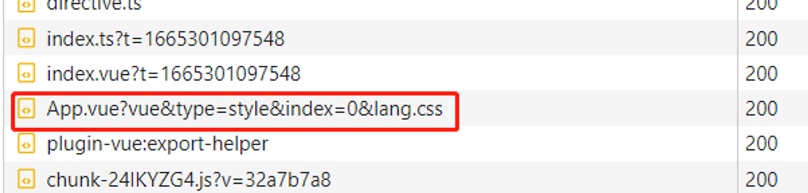

## vite的一些性能优化

注意下面这些都是**开发环境的优化**，vite主要是针对开发体验

- **包预构建：**npm 包这类基本不会变化的模块，使用 Esbuild 在 预构建阶段先打包整理好，减小 http 请求数
- **按需编译：**用户代码这一类频繁变更的模块，直到被使用时才会执行编译操作：处理依赖和引用路径
- **客户端强缓存：**请求过的模块会被以 http 头 max-age=31536000,immutable 设置为强缓存，若是模块发生变化则用附加的版本 query 使其失效
- **产物优化：**相比于 Webpack ，Vite 直接锚定高版本浏览器，不须要在 build 产物中插入过多运行时与模板代码
- **内置更好的分包实现：**默认启用一系列智能分包规则，尽量减小模块的重复打包
- **更好的静态资源处理：**Vite 尽可能避免直接处理静态资源，而是选择遵循 ESM 方式提供服务，例如引入图片 import img from 'xxx.png' 语句，执行后 img 变量只是一个路径字符串

## 运行

Vite主要遵循的是使用ESM(Es modules模块)的规范来执行代码，由于现代浏览器基本上都支持了ESM规范，所以在开发阶段并不需要将代码打包编译成es5代码，即可在浏览器上运行；

- 从入口文件出发， 在遇到对应的 import语句时，将对应的模块加载到浏览器中就可以了（在这Vite才会进行**按需编译**）；
- 对于ts/jsx等文件的转译工作也会借助了esbuild来提升速度
- 在执行run命令后，Vite就会启动一个dev server，然后加载各种中间件，进而监听对应的前端访问请求，同时，会在开发环境中注入Vite自身的client客户端代码，用于监听HMR等处理

## 依赖预构建

依赖预构建是针对项目中**安装的依赖包**，主要的目的是：

- **模块化兼容：**在开发阶段，Vite的解析是基于ES模块的，所以Vite 必须提前处理以 CommonJS 或 UMD 发布的依赖项转换为 ESM
- **减少模块和请求数量：**通过预构建依赖将有许多内部模块的ESM 依赖关系转换为单个模块，从而减少浏览器的请求数量，提升页面加载性能：

  - 比如 loadsh-es 有超过600个内置模块，当执行 import { xxx } from ‘loadsh-es’ 时，浏览器同时发出600多个 HTTP 请求，通过预构建 loadsh-es 成为一个模块，只需要发送一个 HTTP 请求


## 模块解析

虽然浏览器支持 es模块的语法，但是当遇到包依赖（import vue from "vue"）加载时，是不知道去node_modules里找到文件地址的；

Vite 为了解决这个问题**拦截了浏览器对模块的请求并返回处理过的文件路径：**

**对模块加载地址进行重写操作（/@module/）**：将其转换成类似于 import vue from "/@modules/vue" 这种形式，这样在加载文件时判断路径是否以**/@module/开头，如果是的话就去 node_module 找到这个库**

主要通过 es-module-lexer 和 magic-string 两个包：

### [es-module-lexer](https://github.com/guybedford/es-module-lexer)

这个包主要就是用来扫描import语法的，虽然babel也能实现扫描，但是针对ESM文件来说，使用es-module-lexer库在性能上能够有很大的提升，其压缩后的体积只有4kb

**todo** 网上对于这个包的文档不是很多，后面等我看看具体代码再补充这里

### [magic-string](https://github.com/rich-harris/magic-string#readme)

这个包主要是用来重写模块的引入路径，Vite中使用了大量这个库做一些字符串的替换工作，从而避免操作AST，比如`import logo from '/images/logo.png'` 就会处理成个路径字符串

### 自定义区块处理

通过在模块后面链接 ?type= 的参数来区分不同区块，然后针对每个区块单独进行处理，根据不同的区块类型，在转换代码的时候会使用不同的插件进行编译



比如App.vue文件会处理成：

- <template></template>语法转换成import { render as __render } from "/App.vue?type=template"
- 
  <style></style>语法转换成import "/App.vue?type=style&index=0"`
  

再遇到import会发起请求，vite就会根据query去进入不同区块的解析（这里也会将处理过的代码匹配文件路径进行缓存）：

后续如果针对App.vue有改动，会拿出缓存和当前的数据进行比较，判断是哪块内容改动，再通知客户端根据不同的类型重新发请求，读取改动的文件更新


## 内部调用的中间件

服务端可以调用的中间件，先占坑

[https://github.com/vitejs/vite/tree/main/packages/vite/src/node/server/middlewares，](https://github.com/vitejs/vite/tree/main/packages/vite/src/node/server/middlewares)

todo 先带两个过来，后面再详细写

### transformIndexHtml（处理 index.html 文件）

[https://github.com/vitejs/vite/blob/main/packages/vite/src/node/server/middlewares/indexHtml.ts](https://github.com/vitejs/vite/blob/main/packages/vite/src/node/server/middlewares/indexHtml.ts)

用来转换 index.html 的专用钩子[transformIndexHtml](https://cn.vitejs.dev/guide/api-plugin.html#transformindexhtml)，这个钩子用来接收当前的 HTML 字符串和转换上下文，**可以利用这个钩子让相关插件向 HMTL 中加入一些自已的代码/功能**

- vite 在这一步加入了 @vite/client 文件，用来客户端客户端创建 WebSocket，接收服务端热更新传递的消息

这个钩子返回其下类型之一：

- **经过转换的 HTML 字符串：**默认情况下，这个钩子会在HTML 转换后应用，但是开发者也可以通过传入 order = 'pre'｜‘post’ 来定义钩子函数在处理 HMTL 前应用 或者是在所有未定义 order 的钩子函数被应用后应用
- **注入到现有 HTML 中的标签描述符对象数组**（`{ tag, attrs, children }`）：每个标签也可以指定它应该被注入到哪里（默认是在 `<head>` 之前）
- 一个包含 `{ html, tags }` 的对象

```javascript
server.transformIndexHtml = createDevHtmlTransformFn(server); 

function createDevHtmlTransformFn(server) {
    const [preHooks, postHooks] = resolveHtmlTransforms(server.config.plugins);
    return (url, html, originalUrl) => {
        return applyHtmlTransforms(html, [...preHooks, devHtmlHook, ...postHooks], {
            path: url,
            filename: getHtmlFilename(url, server),
            server,
            originalUrl
        });
    };
}

// 处理执行钩子的时机
function resolveHtmlTransforms(plugins) {
    const preHooks = [];
    const postHooks = [];
    for (const plugin of plugins) {
        const hook = plugin.transformIndexHtml;
        if (hook) {
            if (typeof hook === 'function') {
                postHooks.push(hook);
            }
            else if (hook.enforce === 'pre') {
                preHooks.push(hook.transform);
            }
            else {
                postHooks.push(hook.transform);
            }
        }
    }
    return [preHooks, postHooks];
}
```

默认情况下，这个钩子会在HTML 转换后应用，但是开发者也可以通过传入 order = 'pre'｜‘post’ 来定义钩子函数在处理 HMTL 前应用 或者是在所有未定义 order 的钩子函数被应用后应用

```javascript
async function applyHtmlTransforms(html, hooks, ctx) {
    const headTags = [];
    const headPrependTags = [];
    const bodyTags = [];
    const bodyPrependTags = [];
    for (const hook of hooks) {
        const res = await hook(html, ctx);
        if (!res) {
            continue;
        }
        if (typeof res === 'string') {
            html = res; // 针对直接返回html字符串的情况
        }
        else {
            let tags;
            if (Array.isArray(res)) {
                tags = res; // 返回对象数组（｛tag，attrs, children｝）
            }
            else {
                // 包含｛html，tags｝的对象 
                html = res.html || html;
                tags = res.tags;
            }
            // 处理标签插入HTML位置
            for (const tag of tags) {
                if (tag.injectTo === 'body') {
                    bodyTags.push(tag);
                }
                else if (tag.injectTo === 'body-prepend') {
                    bodyPrependTags.push(tag);
                }
                else if (tag.injectTo === 'head') {
                    headTags.push(tag);
                }
                else {
                    headPrependTags.push(tag);
                }
            }
        }
    }
    // 将标签更新到文档
    if (headPrependTags.length) {
        html = injectToHead(html, headPrependTags, true);
    }
    if (headTags.length) {
        html = injectToHead(html, headTags);
    }
    if (bodyPrependTags.length) {
        html = injectToBody(html, bodyPrependTags, true);
    }
    if (bodyTags.length) {
        html = injectToBody(html, bodyTags);
    }
    return html;
}
```

### transformMiddleware（文件转换）

transformMiddleware 中间件主要处理大部分 js、vue、css 等文件资源的加载、解析和转换，针对了一些特定的请求做相关处理：

- isJSRequest：js、ts、jsx、tsx、mjs、vue、svelte等后缀的文件
- isImportRequest：以?或&i开头的import
- isCSSRequest：css、less、sass、scss、styl、stylus、pcss、postcss后缀的文件
- isHTMLProxy：?html-proxy&index=*.js文件

```javascript
//忽略监听的文件
const knownIgnoreList = new Set(['/', '/favicon.ico']);
function transformMiddleware(server) {
    const { config: { root, logger }, moduleGraph, } = server;
    return async function viteTransformMiddleware(req, res, next) {
        //判断请求方法是否为get，或者请求的url不在监听列表就跳过，直接返回
        if (req.method !== 'GET' || knownIgnoreList.has(req.url)) {
            return next();
        }
        let url;
        try {
            url = decodeURI(removeTimestampQuery(req.url)).replace(NULL_BYTE_PLACEHOLDER, '\0');
        }
        catch (e) {
            return next(e);
        }
        //去掉查询参数
        const withoutQuery = cleanUrl(url);
        try {
            //获取到public文件夹的绝对路径
            const publicDir = normalizePath$3(server.config.publicDir);
            //获取根目录的绝对路径
            const rootDir = normalizePath$3(server.config.root);
            if (publicDir.startsWith(rootDir)) {
                 //...处理公共目录下文件访问地址
            }
            //判断是否是js、import、css或html请求
            if (isJSRequest(url) ||
                isImportRequest(url) ||
                isCSSRequest(url) ||
                isHTMLProxy(url)) {
                //处理css请求的文件
                if (isCSSRequest(url) &&
                    !isDirectRequest(url) &&
                    req.headers.accept?.includes('text/css')) {
                    url = injectQuery(url, 'direct');
                }
               
            
                const result = await transformRequest(url, server, {
                    html: req.headers.accept?.includes('text/html'),
                });
                    //返回代码内容
                if (result) {
                    return send$1(req, res, result.code, type, {
                        etag: result.etag,
                        // allow browser to cache npm deps!
                        cacheControl: isDep ? 'max-age=31536000,immutable' : 'no-cache',
                        headers: server.config.server.headers,
                        map: result.map,
                    });
                }
            }
        }
        next();
    };
}
```

#### transformRequest

对文件的请求代码方式解析、加载和转换 url 并获取结果，而不是用http请求，而且每次转换文件后都会用文件地址为key缓存到_pendingRequests，

[https://github.com/vitejs/vite/blob/main/packages/vite/src/node/server/transformRequest.ts](https://github.com/vitejs/vite/blob/main/packages/vite/src/node/server/transformRequest.ts)

```javascript
function transformRequest(url, server, options = {}) {
    const cacheKey = (options.ssr ? 'ssr:' : options.html ? 'html:' : '') + url;
    const timestamp = Date.now();
    const pending = server._pendingRequests.get(cacheKey);
    if (pending) {
        return server.moduleGraph
            .getModuleByUrl(removeTimestampQuery(url), options.ssr)
            .then((module) => {
            if (!module || pending.timestamp > module.lastInvalidationTimestamp) {
                // The pending request is still valid, we can safely reuse its result
                return pending.request;
            }
            else {
                
                pending.abort();
                return transformRequest(url, server, options);
            }
        });
    }
    const request = doTransform(url, server, options, timestamp);
    // Avoid clearing the cache of future requests if aborted
    let cleared = false;
    const clearCache = () => {
        if (!cleared) {
            server._pendingRequests.delete(cacheKey);
            cleared = true;
        }
    };
    // Cache the request and clear it once processing is done
    server._pendingRequests.set(cacheKey, {
        request,
        timestamp,
        abort: clearCache
    });
    request.then(clearCache, clearCache);
    return request;
}
```

#### doTransform

doTransform 方法主要是返回模块转换后的代码

```javascript
async function doTransform(
  url: string,
  server: ViteDevServer,
  options: TransformOptions,
  timestamp: number,
) {
  url = removeTimestampQuery(url)。// 移除url上带的时间戳

  const { config, pluginContainer } = server
  
  // ... ssr相关的先不看


 // 判断模块是不是经过 ModuleNode处理，如果处理过就直接返回
  let module = await server.moduleGraph.getModuleByUrl(url, ssr)
  if (module) {
    const cached = await getCachedTransformResult(
      url,
      module,
      server,
      ssr,
      timestamp,
    )
    if (cached) return cached
  }

  const resolved = module
    ? undefined
    : (await pluginContainer.resolveId(url, undefined, { ssr })) ?? undefined

  // resolve
  const id = module?.id ?? resolved?.id ?? url

  module ??= server.moduleGraph.getModuleById(id)
  if (module) {
    // if a different url maps to an existing loaded id,  make sure we relate this url to the id
    await server.moduleGraph._ensureEntryFromUrl(url, ssr, undefined, resolved)
    // try use cache from id
    const cached = await getCachedTransformResult(
      url,
      module,
      server,
      ssr,
      timestamp,
    )
    if (cached) return cached
  }

  const result = loadAndTransform(
    id,
    url,
    server,
    options,
    timestamp,
    module,
    resolved,
  )

  getDepsOptimizer(config, ssr)?.delayDepsOptimizerUntil(id, () => result)

  return result
}

```


## 缓存

### http缓存

依赖包部分用max-age,immutable 强缓存：安装包基本不会修改

源码部分用304协商缓存（因为业务代码容易修改，所以用协商缓存判断文件内容再返回）

### 文件系统缓存

Vite在预构建阶段，将**构建后的依赖缓存到node_modules/.vite** ，相关配置更改时，或手动控制时才会重新构建，它根据几个源来决定是否需要重新运行预构建步骤：

- package.json 中的 dependenices 列表
- 包管理器的 lockfile，比如 package-lock.json、yarn.lock、pnpm-lock.yml
- 在 vite.config.js 相关字段配置过

在上面其中一项发生更改时，就会重新运行预构建；

也可以使用 —force 命令行选项启动开发服务器，或者手动删除  ‘node_modules/.vite’ 目录

## 开发环境&生产环境

- **开发环境：**使用Esbuild处理项目依赖，利用浏览器原生的ES Module编译能力，对浏览器不能直接执行的非js代码(.jsx、.css、.vue等)，vite只在浏览器请求相关源码的时候进行转换；
- **生产环境：**Vite是采用的Rollup打包构建的，为什么不继续使用Esbuild呢？主要还是稳定的问题

  - Esbuild针对一些构建应用的重要功能还在持续开发，特别是代码分割和css处理方面，Rollup在应用方面会更加成熟与灵活
  - 集成Rollup打包生产环境代码，依赖其成熟稳定的生态与更简洁的插件机制。


## Vite & Webpack

1. **打包编译：**

   - Webpack 启动后会经历一条很长的编译打包链条：语法解析、依赖收集、代码转译、打包合并、代码优化，打包出低版本、高兼容性的产物代码
   - Vite 没有打包的过程，而是直接启动了一个开发服务器devServer 和用 ESbuild预构建依赖，等到请求到对应的模块才简单处理一下内容，整个过程是没有对文件进行打包编译的


2. 热更新：

   - webpack热更新也是需要对修改的模块进行一连串的编译打包过程，然后经过jsop的方式执行的
   - vite因为是浏览器自己import的文件的，所以在代码更新的时候先判断是不是全局配置或者依赖修改，如果是就刷新页面，否则就直接让对应的import失效的，然后设置新的import路径和时间戳啥的
