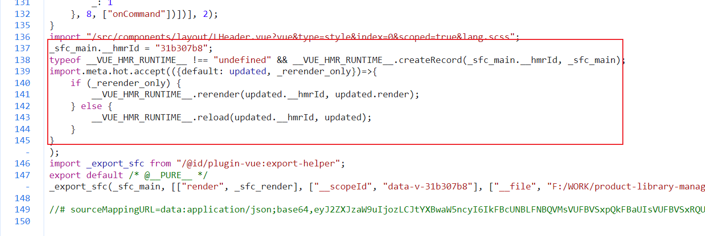

要实现代码热更新，那么主要流程是下面这些：

1. 代码修改
2. 判断哪些代码更新了，重新编译

   1. 怎么编译、编译的产物是什么样的

3. 通知前端代码调整了，需要更新

   1. 通知方式-socket, 如果将websocket 代码注入到浏览器创建链接）

4. 前端进行热更新

   1. 怎么区分是部分更新还是页面刷新


## ModuleNode 和 ModuleGraph

### ModuleNode

一个moduleNode 可以理解为是一个模块，里面描述了这个模块的一些属性

```javascript
class ModuleNode {
    constructor(url) {
        this.id = null; // 模块ID,由【文件系统路径 + query】组成
        this.file = null; // 文件名
        this.importers = new Set<ModuleNode>(); // 引入当前模块的模块，就是被哪些模块引入了
        this.importedModules = new Set<ModuleNode>(); // 当前模块引入了哪些模块
        this.acceptedHmrDeps = new Set<ModuleNode>(); // 热更新相关模块
        this.transformResult = null; // 模块编译后的代码
        this.ssrTransformResult = null;
        this.ssrModule = null;
        this.ssrError = null;
        this.lastHMRTimestamp = 0;
        this.lastInvalidationTimestamp = 0;
        this.url = url; // 请求的 url 地址
        this.type = isDirectCSSRequest(url) ? 'css' : 'js';
        if (isHTMLRequest(url) || canSkipImportAnalysis(url)) {
            this.isSelfAccepting = false; // 该模块自身是否能进行热更新，这里的html文件或一些json文件就不能
        }
    }
}
```

### ModuleGraph

ModuleGraph 名字听起来像是一个名词，但感觉它的作用更像是个动词

其实从数据层面上来说，ModuleNode就像是一个树形结构的模块依赖图了

ModuleGraph 的作用是为了更方便的去操作对应节点 ModuleNode，比如查找、创建、更新、删除等功能，说白了就是提供了一些操作方法


```javascript
class ModuleNode {
    constructor(url) {
        this.id = null; // 模块ID,由【文件系统路径 + query】组成
        this.file = null; // 文件名
        this.importers = new Set<ModuleNode>(); // 引入当前模块的模块，就是被哪些模块引入了
        this.importedModules = new Set<ModuleNode>(); // 当前模块引入了哪些模块
        this.acceptedHmrDeps = new Set<ModuleNode>(); // 热更新相关模块
        this.transformResult = null; // 模块编译后的代码
        this.ssrTransformResult = null;
        this.ssrModule = null;
        this.ssrError = null;
        this.lastHMRTimestamp = 0;
        this.lastInvalidationTimestamp = 0;
        this.url = url; // 请求的 url 地址
        this.type = isDirectCSSRequest(url) ? 'css' : 'js';
        if (isHTMLRequest(url) || canSkipImportAnalysis(url)) {
            this.isSelfAccepting = false; // 该模块自身是否能进行热更新，这里的html文件或一些json文件就不能
        }
    }
}
function invalidateSSRModule(mod, seen) {
    if (seen.has(mod)) {
        return;
    }
    seen.add(mod);
    mod.ssrModule = null;
    mod.importers.forEach((importer) => invalidateSSRModule(importer, seen));
}
class ModuleGraph {
    constructor(resolveId) {
        this.resolveId = resolveId;
        this.urlToModuleMap = new Map();
        this.idToModuleMap = new Map();
        this.fileToModulesMap = new Map();
        this.safeModulesPath = new Set();
    }
    // 根据url获取moduleNode
    async getModuleByUrl(rawUrl, ssr):Promise<ModuleNode|undefined> {
        // 删除url上的timestamp query (?t=xxxx)、处理带/不带拓展的url都映射到同一个模块
        const [url] = await this.resolveUrl(rawUrl, ssr);
        return this.urlToModuleMap.get(url);
    }
    // 通过 id 获取 ModuleNode
    getModuleById(id) {
        return this.idToModuleMap.get(removeTimestampQuery(id));
    }
    // 通过 file 获取 ModuleNode
    getModulesByFile(file) {
        return this.fileToModulesMap.get(file);
    }

    onFileChange(file) {
        const mods = this.getModulesByFile(file);
        if (mods) {
            const seen = new Set();
            mods.forEach((mod) => {
                this.invalidateModule(mod, seen);
            });
        }
    }
    // 将 ModuleNode 设置为失效的，在热更新的时候，把之前编译好的模块代码失效
    invalidateModule(mod, seen = new Set(), timestamp = Date.now()) {
        mod.lastInvalidationTimestamp = timestamp;
        mod.transformResult = null;
        mod.ssrTransformResult = null;
        invalidateSSRModule(mod, seen);
    }
    // 把所有的 ModuleNode 设置为失效
    invalidateAll() {
        const timestamp = Date.now();
        const seen = new Set();
        this.idToModuleMap.forEach((mod) => {
            this.invalidateModule(mod, seen, timestamp);
        });
    }
    // 更新 ModuleNode 的依赖信息
    // 函数返回值为不再 import 的依赖的 Set 集合（以前依赖的 import 现在不 import 的）
    async updateModuleInfo(mod, importedModules, acceptedModules, isSelfAccepting, ssr) {
        mod.isSelfAccepting = isSelfAccepting;
        const prevImports = mod.importedModules;
        const nextImports = (mod.importedModules = new Set());
        let noLongerImported;
        // 先获取最新的 importModules
        for (const imported of importedModules) {
            const dep = typeof imported === 'string'
                ? await this.ensureEntryFromUrl(imported, ssr)
                : imported;
            dep.importers.add(mod);
            nextImports.add(dep);
        }
        // 找到之前import 现在不再 import 的模块
        prevImports.forEach((dep) => {
            if (!nextImports.has(dep)) {
                dep.importers.delete(mod);
                if (!dep.importers.size) {
                    (noLongerImported || (noLongerImported = new Set())).add(dep);
                }
            }
        });
        // 更新热更新相关的 NodeModule
        const deps = (mod.acceptedHmrDeps = new Set());
        for (const accepted of acceptedModules) {
            const dep = typeof accepted === 'string'
                ? await this.ensureEntryFromUrl(accepted, ssr)
                : accepted;
            deps.add(dep);
        }
        return noLongerImported;
    }
	async ensureEntryFromUrl(rawUrl, ssr) {
        const [url, resolvedId, meta] = await this.resolveUrl(rawUrl, ssr);
        let mod = this.urlToModuleMap.get(url);
        if (!mod) {
            mod = new ModuleNode(url);
            if (meta)
                mod.meta = meta;
            this.urlToModuleMap.set(url, mod);
            mod.id = resolvedId;
            this.idToModuleMap.set(resolvedId, mod);
            const file = (mod.file = cleanUrl(resolvedId));
            let fileMappedModules = this.fileToModulesMap.get(file);
            if (!fileMappedModules) {
                fileMappedModules = new Set();
                this.fileToModulesMap.set(file, fileMappedModules);
            }
            fileMappedModules.add(mod);
        }
        return mod;
    }
	async resolveUrl(url, ssr) {
        url = removeImportQuery(removeTimestampQuery(url));
        const resolved = await this.resolveId(url, !!ssr);
        const resolvedId = (resolved === null || resolved === void 0 ? void 0 : resolved.id) || url;
        const ext = path$r.extname(cleanUrl(resolvedId));
        const { pathname, search, hash } = require$$0$6.parse(url);
        if (ext && !pathname.endsWith(ext)) {
            url = pathname + ext + (search || '') + (hash || '');
        }
        return [url, resolvedId, resolved === null || resolved === void 0 ? void 0 : resolved.meta];
    }
    createFileOnlyEntry(file){
	 // ...
    }
	
}
```

## **热**更新边界

“热更新边界”也叫最近的可接受热更新的模块；

如果我们对 vue 组件依赖的js 文件修改时，vite会对这个vue 文件进行更新-重新加载组件，这种情况这个vue 我那件就被称为 “热更新边界”

## websocket 创建

在我们启动项目时，vite devServer 会在 index.html 里面注入 @vite/client 的脚本，client.js 里会创建客户端websocket ，接收ws服务端信息更新且执行 hmr 相关 hook

vite devServer 监听文件变化，给客户端发送 websocket 消息，带上模块信息和更新方式（页面刷新or部分更新）等


handleMessage  主要处理各种 message ：

```javascript
async function handleMessage(payload) {
  switch (payload.type) {
    case 'connected':
      console.log('[vite] connected.')
      sendMessageBuffer()
      // proxy(nginx, docker) hmr ws maybe caused timeout,
      // so send ping package let ws keep alive.
      setInterval(() => socket.send('{"type":"ping"}'), 30000)
      break
    case 'update':
      // 模块更新
      notifyListeners('vite:beforeUpdate', payload)
      if (isFirstUpdate && hasErrorOverlay()) {
        // 第一次加载就报错了，那么下次需要刷新页面处理，不能直接处理更新模块逻辑
        window.location.reload()
        return
      } else {
        clearErrorOverlay()
        isFirstUpdate = false
      }
      payload.updates.forEach((update) => {
        if (update.type === 'js-update') {
          // js 模块代码更新
          queueUpdate(fetchUpdate(update))
        } else {
          // css 模块代码更新（只处理已 <link>标签引入的css文件）
          const { path, timestamp } = update
          const searchUrl = cleanUrl(path)
          const el = Array.from(document.querySelectorAll('link')).find((e) => cleanUrl(e.href).includes(searchUrl))
          if (el) {
            const newPath = `${base}${searchUrl.slice(1)}${searchUrl.includes('?') ? '&' : '?'}t=${timestamp}`
            // rather than swapping the href on the existing tag, we will
            // create a new link tag. Once the new stylesheet has loaded we
            // will remove the existing link tag. This removes a Flash Of
            // Unstyled Content that can occur when swapping out the tag href
            // directly, as the new stylesheet has not yet been loaded.
            const newLinkTag = el.cloneNode()
            newLinkTag.href = new URL(newPath, el.href).href
            const removeOldEl = () => el.remove()
            newLinkTag.addEventListener('load', removeOldEl)
            newLinkTag.addEventListener('error', removeOldEl)
            el.after(newLinkTag)
          }
          console.log(`[vite] css hot updated: ${searchUrl}`)
        }
      })
      break
    case 'custom': {
      // 自定义
      notifyListeners(payload.event, payload.data)
      break
    }
    case 'full-reload':
      // 处理刷新页面
      notifyListeners('vite:beforeFullReload', payload)
      if (payload.path && payload.path.endsWith('.html')) {
        const pagePath = decodeURI(location.pathname)
        const payloadPath = base + payload.path.slice(1)
        if (pagePath === payloadPath || (pagePath.endsWith('/') && pagePath + 'index.html' === payloadPath)) {
          location.reload()
        }
        return
      } else {
        location.reload()
      }
      break
    case 'prune':
      // 处理模块删除
      notifyListeners('vite:beforePrune', payload)
      payload.paths.forEach((path) => {
        const fn = pruneMap.get(path)
        if (fn) {
          fn(dataMap.get(path))
        }
      })
      break
    case 'error': {
      // 处理错误
      notifyListeners('vite:error', payload)
      const err = payload.err
      if (enableOverlay) {
        createErrorOverlay(err)
      } else {
        console.error(`[vite] Internal Server Error\n ${err.message}\n ${err.stack}`)
      }
      break
    }
    default: {
      const check = payload
      return check
    }
  }
}
```

vite 的 plugin-vue 插件，也会在编译的过程中把热更新相关的代码注入到 xx.vue 文件里

这里我理解的.vue 文件就是热更新边界，js文件是不会注入 热更新相关代码的，所以需要向上找到vue文件进行组件级的更新，再执行旧的.vue 文件的 import.meta.hot.dispose 回调，再重新编译vue文件



## 参考文档：

[https://zhuanlan.zhihu.com/p/596363666](https://zhuanlan.zhihu.com/p/596363666)