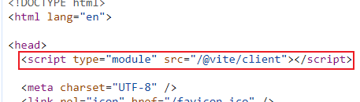

要实现代码热更新，那么主要流程是下面这些：

1. 代码修改
2. 判断哪些代码更新了，重新编译：怎么编译、编译的产物是什么样的
3. 通知前端代码调整了，需要更新：通知方式-socket, 将ws 代码注入到浏览器创建链接（client.js 注入到index.html里）
4. 前端进行热更新：怎么区分是部分更新还是页面刷新

Vite中HMR是在原生 ESM 上执行的。当编辑一个文件时，Vite 只需要精确地使已编辑的模块失活（判断热更新边界），使得无论应用大小如何，HMR 始终能保持快速更新。

## ModuleNode 和 ModuleGraph

### ModuleNode

一个moduleNode 可以理解为是一个模块，里面描述了这个模块的一些属性：比如当前模块的名称、代码编译的结果、模块内的引用/被引用等

- **importers：**这个字段主要是记录了当前模块被哪些模块引用了（类似于向上查找），这个字段是在对块地址重写的时候处理的，在后续热更新的时候是通过这个来查找热更新边界的

```javascript
class ModuleNode {
    constructor(url) {
        this.id = null; // 模块ID,由【文件系统路径 + query】组成
        this.file = null; // 文件名
        this.importers = new Set<ModuleNode>(); // 引入当前模块的模块，就是被哪些模块引入了
        this.importedModules = new Set<ModuleNode>(); // 当前模块引入了哪些模块
        this.acceptedHmrDeps = new Set<ModuleNode>(); // 热更新相关模块
        this.transformResult = null; // 模块编译后的代码
        this.ssrTransformResult = null;
        this.ssrModule = null;
        this.ssrError = null;
        this.lastHMRTimestamp = 0;
        this.lastInvalidationTimestamp = 0;
        this.url = url; // 请求的 url 地址
        this.type = isDirectCSSRequest(url) ? 'css' : 'js';
        if (isHTMLRequest(url) || canSkipImportAnalysis(url)) {
            this.isSelfAccepting = false; // 该模块自身是否能进行热更新，这里的html文件或一些json文件就不能
        }
    }
}
```

### ModuleGraph

其实从数据层面上来说，ModuleNode就像是一个树形结构的模块依赖图了

ModuleGraph 的作用是为了更方便的去操作对应节点 ModuleNode，比如查找、创建、更新、删除等功能，说白了就是提供了一些操作方法

```javascript
function invalidateSSRModule(mod, seen) {
    if (seen.has(mod)) {
        return;
    }
    seen.add(mod);
    mod.ssrModule = null;
    mod.importers.forEach((importer) => invalidateSSRModule(importer, seen));
}
class ModuleGraph {
    constructor(resolveId) {
        this.resolveId = resolveId;
        this.urlToModuleMap = new Map();
        this.idToModuleMap = new Map();
        this.fileToModulesMap = new Map();
        this.safeModulesPath = new Set();
    }
    // 根据url获取moduleNode
    async getModuleByUrl(rawUrl, ssr):Promise<ModuleNode|undefined> {
        // 删除url上的timestamp query (?t=xxxx)、处理带/不带拓展的url都映射到同一个模块
        const [url] = await this.resolveUrl(rawUrl, ssr);
        return this.urlToModuleMap.get(url);
    }
    // 通过 id 获取 ModuleNode
    getModuleById(id) {
        return this.idToModuleMap.get(removeTimestampQuery(id));
    }
    // 通过 file 获取 ModuleNode
    getModulesByFile(file) {
        return this.fileToModulesMap.get(file);
    }

    onFileChange(file) {
        const mods = this.getModulesByFile(file);
        if (mods) {
            const seen = new Set();
            mods.forEach((mod) => {
                this.invalidateModule(mod, seen);
            });
        }
    }
    // 将 ModuleNode 设置为失效的，在热更新的时候，把之前编译好的模块代码失效
    invalidateModule(mod, seen = new Set(), timestamp = Date.now()) {
        mod.lastInvalidationTimestamp = timestamp;
        mod.transformResult = null;
        mod.ssrTransformResult = null;
        invalidateSSRModule(mod, seen);
    }
    // 把所有的 ModuleNode 设置为失效
    invalidateAll() {
        const timestamp = Date.now();
        const seen = new Set();
        this.idToModuleMap.forEach((mod) => {
            this.invalidateModule(mod, seen, timestamp);
        });
    }
    // 更新 ModuleNode 的依赖信息
    // 函数返回值为不再 import 的依赖的 Set 集合（以前依赖的 import 现在不 import 的）
    async updateModuleInfo(mod, importedModules, acceptedModules, isSelfAccepting, ssr) {
        mod.isSelfAccepting = isSelfAccepting;
        const prevImports = mod.importedModules;
        const nextImports = (mod.importedModules = new Set());
        let noLongerImported;
        // 先获取最新的 importModules
        for (const imported of importedModules) {
            const dep = typeof imported === 'string'
                ? await this.ensureEntryFromUrl(imported, ssr)
                : imported;
            dep.importers.add(mod);
            nextImports.add(dep);
        }
        // 找到之前import 现在不再 import 的模块
        prevImports.forEach((dep) => {
            if (!nextImports.has(dep)) {
                dep.importers.delete(mod);
                if (!dep.importers.size) {
                    (noLongerImported || (noLongerImported = new Set())).add(dep);
                }
            }
        });
        // 更新热更新相关的 NodeModule
        const deps = (mod.acceptedHmrDeps = new Set());
        for (const accepted of acceptedModules) {
            const dep = typeof accepted === 'string'
                ? await this.ensureEntryFromUrl(accepted, ssr)
                : accepted;
            deps.add(dep);
        }
        return noLongerImported;
    }
	async ensureEntryFromUrl(rawUrl, ssr) {
        const [url, resolvedId, meta] = await this.resolveUrl(rawUrl, ssr);
        let mod = this.urlToModuleMap.get(url);
        if (!mod) {
            mod = new ModuleNode(url);
            if (meta)
                mod.meta = meta;
            this.urlToModuleMap.set(url, mod);
            mod.id = resolvedId;
            this.idToModuleMap.set(resolvedId, mod);
            const file = (mod.file = cleanUrl(resolvedId));
            let fileMappedModules = this.fileToModulesMap.get(file);
            if (!fileMappedModules) {
                fileMappedModules = new Set();
                this.fileToModulesMap.set(file, fileMappedModules);
            }
            fileMappedModules.add(mod);
        }
        return mod;
    }
	async resolveUrl(url, ssr) {
        url = removeImportQuery(removeTimestampQuery(url));
        const resolved = await this.resolveId(url, !!ssr);
        const resolvedId = (resolved === null || resolved === void 0 ? void 0 : resolved.id) || url;
        const ext = path$r.extname(cleanUrl(resolvedId));
        const { pathname, search, hash } = require$$0$6.parse(url);
        if (ext && !pathname.endsWith(ext)) {
            url = pathname + ext + (search || '') + (hash || '');
        }
        return [url, resolvedId, resolved === null || resolved === void 0 ? void 0 : resolved.meta];
    }
    createFileOnlyEntry(file){
	 // ...
    }
	
}
```


## websocket 创建

在启动项目时，vite DevServer 会在 index.html 里面注入 @vite/client 的脚本，client.js 里会创建客户端websocket ，接收ws服务端信息更新且执行 hmr 相关 hook

vite devServer 监听文件变化，给客户端发送 websocket 消息，带上模块信息和更新方式（页面刷新or部分更新）等



### createWebSocketServer（创建ws）

服务端代码主要是在/node/server/ws文件里

```javascript
export function createWebSocketServer(
  server: Server | null,
  config: ResolvedConfig,
  httpsOptions?: HttpsServerOptions
): WebSocketServer {
  let wss: WebSocketServerRaw
  let httpsServer: Server | undefined = undefined

  const hmr = isObject(config.server.hmr) && config.server.hmr
  const hmrServer = hmr && hmr.server
  const hmrPort = hmr && hmr.port
  // TODO: the main server port may not have been chosen yet as it may use the next available
  const portsAreCompatible = !hmrPort || hmrPort === config.server.port
  const wsServer = hmrServer || (portsAreCompatible && server)
  const customListeners = new Map<string, Set<WebSocketCustomListener<any>>>()
  const clientsMap = new WeakMap<WebSocketRaw, WebSocketClient>()

  if (wsServer) {
    wss = new WebSocketServerRaw({ noServer: true })
    wsServer.on('upgrade', (req, socket, head) => {
      if (req.headers['sec-websocket-protocol'] === HMR_HEADER) {
        wss.handleUpgrade(req, socket as Socket, head, (ws) => {
          wss.emit('connection', ws, req)
        })
      }
    })
  } else {
    const websocketServerOptions: ServerOptions = {}
    const port = hmrPort || 24678
    const host = (hmr && hmr.host) || undefined
    if (httpsOptions) {
      // if we're serving the middlewares over https, the ws library doesn't support automatically creating an https server, so we need to do it ourselves
      // create an inline https server and mount the websocket server to it
      httpsServer = createHttpsServer(httpsOptions, (req, res) => {
        const statusCode = 426
        const body = STATUS_CODES[statusCode]
        if (!body)
          throw new Error(
            `No body text found for the ${statusCode} status code`
          )

        res.writeHead(statusCode, {
          'Content-Length': body.length,
          'Content-Type': 'text/plain'
        })
        res.end(body)
      })

      httpsServer.listen(port, host)
      websocketServerOptions.server = httpsServer
    } else {
      // we don't need to serve over https, just let ws handle its own server
      websocketServerOptions.port = port
      if (host) {
        websocketServerOptions.host = host
      }
    }

    // vite dev server in middleware mode
    wss = new WebSocketServerRaw(websocketServerOptions)
  }

  wss.on('connection', (socket) => {
    socket.on('message', (raw) => {
      if (!customListeners.size) return
      let parsed: any
      try {
        parsed = JSON.parse(String(raw))
      } catch {}
      if (!parsed || parsed.type !== 'custom' || !parsed.event) return
      const listeners = customListeners.get(parsed.event)
      if (!listeners?.size) return
      const client = getSocketClient(socket)
      listeners.forEach((listener) => listener(parsed.data, client))
    })
    socket.send(JSON.stringify({ type: 'connected' }))
    if (bufferedError) {
      socket.send(JSON.stringify(bufferedError))
      bufferedError = null
    }
  })

  // 处理连接错误 
  wss.on('error', (e: Error & { code: string }) => {
    // ...
  })

  // Provide a wrapper to the ws client so we can send messages in JSON format
  // To be consistent with server.ws.send
  function getSocketClient(socket: WebSocketRaw) {
    if (!clientsMap.has(socket)) {
      clientsMap.set(socket, {
        send: (...args) => {
          let payload: HMRPayload
          if (typeof args[0] === 'string') {
            payload = {
              type: 'custom',
              event: args[0],
              data: args[1]
            }
          } else {
            payload = args[0]
          }
          socket.send(JSON.stringify(payload))
        },
        socket
      })
    }
    return clientsMap.get(socket)!
  }

  // On page reloads, if a file fails to compile and returns 500, the server
  // sends the error payload before the client connection is established.
  // If we have no open clients, buffer the error and send it to the next
  // connected client.
  let bufferedError: ErrorPayload | null = null

  return {
    on: ((event: string, fn: () => void) => {
      if (wsServerEvents.includes(event)) wss.on(event, fn)
      else {
        if (!customListeners.has(event)) {
          customListeners.set(event, new Set())
        }
        customListeners.get(event)!.add(fn)
      }
    }) as WebSocketServer['on'],
    off: ((event: string, fn: () => void) => {
      if (wsServerEvents.includes(event)) {
        wss.off(event, fn)
      } else {
        customListeners.get(event)?.delete(fn)
      }
    }) as WebSocketServer['off'],

    get clients() {
      return new Set(Array.from(wss.clients).map(getSocketClient))
    },

    send(...args: any[]) {
      let payload: HMRPayload
      if (typeof args[0] === 'string') {
        payload = {
          type: 'custom',
          event: args[0],
          data: args[1]
        }
      } else {
        payload = args[0]
      }

      if (payload.type === 'error' && !wss.clients.size) {
        bufferedError = payload
        return
      }

      const stringified = JSON.stringify(payload)
      wss.clients.forEach((client) => {
        // readyState 1 means the connection is open
        if (client.readyState === 1) {
          client.send(stringified)
        }
      })
    },

    close() {
      return new Promise((resolve, reject) => {
        wss.clients.forEach((client) => {
          client.terminate()
        })
        wss.close((err) => {
          if (err) {
            reject(err)
          } else {
            if (httpsServer) {
              httpsServer.close((err) => {
                if (err) {
                  reject(err)
                } else {
                  resolve()
                }
              })
            } else {
              resolve()
            }
          }
        })
      })
    }
  }
}
```


### client（客户端）

注入客户端的代码位置：/src/client/client

- handleMessage  主要处理不同的模块更新方式，比如页面刷新、js内容刷新，样式刷新等
- 在server端获取到文件更新之后会推送到client端，然后根据不同的type进行处理：vue-reload、vue-rerender、style-update、style-remove、js-update、custom、full-reload；针对于vue的处理是直接使用vue3.0中的更新方法进行组件更新

```javascript
// use server configuration, then fallback to inference
const socketProtocol =
  __HMR_PROTOCOL__ || (location.protocol === 'https:' ? 'wss' : 'ws')
const socketHost = `${__HMR_HOSTNAME__ || location.hostname}:${__HMR_PORT__}`
const socket = new WebSocket(`${socketProtocol}://${socketHost}`, 'vite-hmr')
const base = __BASE__ || '/'
const messageBuffer: string[] = []

// Listen for messages
socket.addEventListener('message', async ({ data }) => {
  handleMessage(JSON.parse(data))
})

async function handleMessage(payload: HMRPayload) {
  switch (payload.type) {
    case 'connected':
      console.log(`[vite] connected.`)
      sendMessageBuffer()
      setInterval(() => socket.send('{"type":"ping"}'), __HMR_TIMEOUT__)
      break
    case 'update':
      notifyListeners('vite:beforeUpdate', payload)
      if (isFirstUpdate && hasErrorOverlay()) {
        window.location.reload() // 第一次加载就报错了，那么下次需要刷新页面处理，不能直接处理更新模块逻辑
        return
      } else {
        clearErrorOverlay()
        isFirstUpdate = false
      }
      payload.updates.forEach((update) => {
        if (update.type === 'js-update') {
          queueUpdate(fetchUpdate(update)) // js 模块代码更新
        } else {
          // css 模块代码更新（只处理已 <link>标签引入的css文件
          const { path, timestamp } = update
          const searchUrl = cleanUrl(path)
          const el = Array.from(
            document.querySelectorAll<HTMLLinkElement>('link')
          ).find((e) => cleanUrl(e.href).includes(searchUrl))
          if (el) {
            const newPath = `${base}${searchUrl.slice(1)}${
              searchUrl.includes('?') ? '&' : '?'
            }t=${timestamp}`
            el.href = new URL(newPath, el.href).href
          }
          console.log(`[vite] css hot updated: ${searchUrl}`)
        }
      })
      break
    case 'custom': {
      notifyListeners(payload.event, payload.data)
      break
    }
    // 整个页面刷新，一般是修改了vite配置或者依赖
    case 'full-reload':
      notifyListeners('vite:beforeFullReload', payload)
      if (payload.path && payload.path.endsWith('.html')) {
        // if html file is edited, only reload the page if the browser is
        // currently on that page.
        const pagePath = decodeURI(location.pathname)
        const payloadPath = base + payload.path.slice(1)
        if (
          pagePath === payloadPath ||
          payload.path === '/index.html' ||
          (pagePath.endsWith('/') && pagePath + 'index.html' === payloadPath)
        ) {
          location.reload()
        }
        return
      } else {
        location.reload()
      }
      break
    // 处理模块删除，比如之前引入的模块后面不引入了，需要清除
    case 'prune':
      notifyListeners('vite:beforePrune', payload)
      payload.paths.forEach((path) => {
        const fn = pruneMap.get(path)
        if (fn) {
          fn(dataMap.get(path))
        }
      })
      break
    case 'error': {
      notifyListeners('vite:error', payload)
      const err = payload.err
      if (enableOverlay) {
        createErrorOverlay(err)
      } else {
        console.error(
          `[vite] Internal Server Error\n${err.message}\n${err.stack}`
        )
      }
      break
    }
    default: {
      const check: never = payload
      return check
    }
  }
}

// ping server
socket.addEventListener('close', async ({ wasClean }) => {
  if (wasClean) return
  console.log(`[vite] server connection lost. polling for restart...`)
  await waitForSuccessfulPing()
  location.reload()
})
```

vite 的 plugin-vue 插件，也会在编译的过程中把热更新相关的代码注入到 xx.vue 文件里

这里我理解的.vue 文件就是热更新边界，js文件是不会注入热更新相关代码的，所以需要向上找到vue文件进行组件级的更新，再执行旧的.vue 文件的 import.meta.hot.dispose 回调，再重新编译vue文件


## 监听文件变化（chokidar）

vite和 webpack 用的是一样的解决方案 chokidar；

- 虽然nodejs 本身有 fs 模块的 api 来实现文件监听的功能，但是因为缺少一系列的优化，会带来一系列的问题，chokidar在保证原来功能的基础上做了一系列的优化，可以更快的响应，兼容性也刚好

```javascript
// 这段代码是在 createServer里面
const watcher = chokidar.watch(path.resolve(root), {
    ignored: [
      '**/node_modules/**',
      '**/.git/**',
      ...(Array.isArray(ignored) ? ignored : [ignored])
    ],
    ignoreInitial: true,
    ignorePermissionErrors: true,
    disableGlobbing: true,
    ...watchOptions
  }) as FSWatcher

watcher.on('change', async (file) => {
    file = normalizePath(file)
    if (file.endsWith('/package.json')) {
      return invalidatePackageData(packageCache, file)
    }
    // invalidate module graph cache on file change
    moduleGraph.onFileChange(file)
    if (serverConfig.hmr !== false) {
      try {
        await handleHMRUpdate(file, server)
      } catch (err) {
        ws.send({
          type: 'error',
          err: prepareError(err)
        })
      }
    }
  })

  watcher.on('add', (file) => {
    handleFileAddUnlink(normalizePath(file), server)
  })

  watcher.on('unlink', (file) => {
    handleFileAddUnlink(normalizePath(file), server, true)
  })
```

## 更新时间

- 在Vite中，HMR是在原生的 ESM上执行的，当编辑一个文件时，Vite只需要精确地使用已编辑模块与其最近的HMR 边界之间的链失活（大多时候是模块本身），使得无论应用大小如何，HMR始终能保持快速更新
- Vite 同时利用HTTP头来加速整个页面的重新加载，源码模块的请求会根据304 Not Modified 进行协商缓存，而依赖模块请求则会通过 Cache-Control：max-age=31536000，immutable 进行缓存，因此旦被缓存它们就不需要再次请求

### **热**更新边界

“热更新边界”也叫最近的可接受热更新的模块；

如果我们对 vue 组件依赖的js 文件修改时，vite会对这个vue 文件进行更新-重新加载组件，这种情况这个vue 我那件就被称为 “热更新边界”

