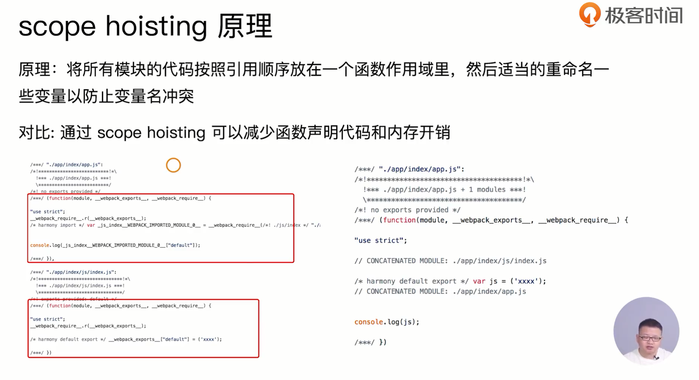

## 问题

- 大量函数闭包包裹代码，导致体积增大（模块越多越明显）；
- 运行代码时创建的函数作用域变多，内存开销变大；

## 模块转换分析

将模块

```javascript
import { helloworld } from './helloworld';
import '../../common';
document.write(helloworld());
```

转换成模块初始化函数：

```javascript
/* 0 */
/***/ (function(module, _webpack_exports_, _webpack_require_) {
"use strict";
_webpack_require_.r( webpack exports );

/* harmony import */ var _common_WEBPACK_IMPORTED_MODULE_0 = _webpack_require_(1);
/* harmony import */ var _helloworld_WEBPACK_IMPORTED_MODULE_1 = _webpack_require_(2);

document.write(object( helloworld WEBPACK IMPORTED MODULE 1 ["helloworld"1)));

***/）

```

1. 被webpack转换后的模块会带上一层包裹；
2. import 会被转换成 _webpack_require()方法，参数传入模块ID；

## webpack的模块机制

- 打包出来是一个IIFE（匿名执行函数）；
- modules 是一个数组，每一项是一个模块初始化函数；
- _webpack_require 用来加载模块，返回 modules.exports；
- 通过 WEBPACK_REQUIRE_METHOD(0)启动程序；

```javascript

(function (modules) {
	var installedModules = {}
	function webpack require (moduleId) {
	  if (installedModules[moduleId]) return installedModules[moduleId].exports;
      var module = installedModules[moduleId]= {
        i: moduleId,
        l: false,  // 模块是否加载
       	exports:{}
      }
	 modules[moduleId].call(module.exports, module, module.exports, _webpack_require_)
      module.1 = true;
      return module.exports;
    }
    _webpack_require__(0);
})([
  /* 0 module */
  (function (module, webpack exports,_webpack_require_ ){...}),
  /* 1 module */
  (function (module, webpack exports,_webpack_require_ ){...}),
  /* n module */
  (function (module, webpack exports,_webpack_require_ ){...})
])
```

## scope hoisiting

> 将所有模块的代码按照引用顺序放在一个函数作用域里，然后适当的重命名一些变量以防变量名冲突；

通过scope hoisting 可以减少函数声明代码和内存开销；


## 使用

必须是es6语法，CJS 不支持；

1. webpack3 需要手动引入插件配置；

```javascript
module.exports = [
  entry：{
  	app: './src/app.js',
  	search: './src/search.js',
  },
  output: {
  	filname: '[name][chunkhash:8].js',
    path:_dirname + '/dist',
  },
  plugins:[
  	new webpack.optimize.ModuleConcatenationPlugin()
  ]
]
```


1. webpack 4 当mode 为 production 时默认开启；

