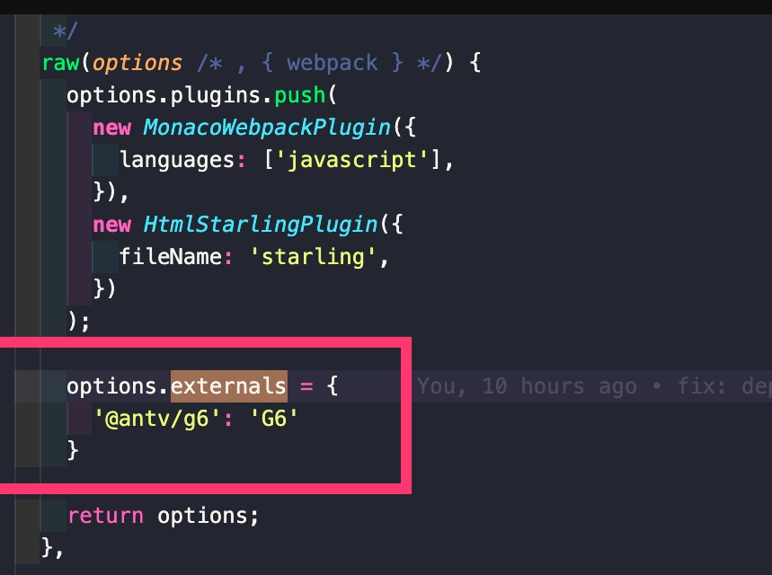

## 解析代码路径

> webpack 依赖 enhanced-resolve 来解析代码模块的路径；

模块解析规则分三种：

1. **解析相对路径：**

   - 查找相对当前模块的路径下是否有对应文件或文件夹，是文件则直接加载；
   - 如果是文件夹则找到对应文件夹下是否有 package.json 文件；
   - 有的话就按照文件中的 main 字段的文件名来查找文件；
   - 没有 package.json 或 main，则查找 index.js 文件；

2. **解析绝对路径：**直接查找对应路径的文件；
3. **解析模块名：**查找当前文件目录，父级直至根目录下的 node_modules 文件夹，看是否有对应名称的模块；

## source-map

> source-map 是将编译、打包、压缩后的代码映射回源码的过程；

1. 打包压缩后的代码不具备良好的可读性，想要调试源码就需要 source map，出错的时候，浏览器控制台将直接显示原始代码出错的位置；
2. 避免在生产中使用 inline- 和 eval-，因为它们会增加 bundle 体积大小，并降低整体性能；
3. map 文件只要不打开开发者工具，浏览器是不会加载的；

生产环境一般有三种处理方案：

1. source-map：map 文件包含完整的原始代码，但是打包会很慢，打包后的 js 最后一行是 map 文件地址的注释，通过 nginx 设置将 .map 文件只对白名单开放；
2. hideen-source-map：只隐藏源代码，会提示构建后代码错误信息；
3. nosources-source-map：全部隐藏：只会显示具体行数以及查看源码的错误栈，安全性比 sourcemap 高；

## 模块打包

1. 根据 webpack.config.js 中的入口文件并识别模块依赖，自动进行分析，并通过转换、编译代码、打包成最终的文件；
2. 最终文件中的模块实现是基于 **webpack 自己实现的 webpack_require（ES5 代码）**，打包后的文件可以跑在浏览器上；
3. 针对异步模块，webpack 实现模块的异步加载类似 jsonp 的流程；

   - 遇到异步模块时，使用 _ webpack_require_.e 函数把异步代码加载进来，该函数会在 html 的 head 标签中动态增加 script 标签，src 指向指定的异步模块存放的文件；
   - 加载的异步模块文件会执行 webpackJsonpCallback 函数，把异步模块加载到主文件中；
   - 后续可以像同步模块一样,直接使用 __ webpack_require__("./src/async.js") 加载异步模块；


## 文件监听

> 在发现源码发生变化时，自动重新构建出新的输出文件；

轮询判断文件的最后编辑时间是否变化，初次构建时把文件的修改时间储存起来，下次有修改时进行时间对比，并且先缓存起来，等 aggregateTimeout 后，把变化列表一起构建，并生成到 bundle 文件夹；

```javascript
module.export = {
  // 默认 false，也就是不开启
  watch: true,
  watchOptions: {
    // 默认为空，不监听的文件夹或者文件，支持正则匹配
    ignore: /node_modules/,
    // 监听到变化发生后会等 300ms 再去执行，默认 300ms
    aggregateTimeout: 300,
    // 判断文件是否发生变化是通过不停询问系统指定文件有没有变化实现的，默认每秒询问 1000 次
    poll: 1000,
  },
};
```

## 优化Loader

> 主要是优化搜索时间、缩小文件搜索范围、减少不必要的编译工作；

```javascript
 module: {
    rules:[
      {
        // 如果项目源码中只有js文件，就不要写成/\jsx?$/，以提升正则表达式的性能
        test: /\.js$/, 
        // babel-loader 支持缓存转换出的结果，通过 cacheDirectory 选项开启
        use:['babel-loader?cacheDirectory'],
        // 只对项目根目录下 src 目录中的文件采用 babel-loader
        include:path.resolve(__dirname,'src'),
        // 使用resolve.alias把原导入路径映射成一个新的导入路径，减少耗时的递归解析操作
        alias: {
          'react': path.resolve( __dirname ,'./node_modules/react/dist/react.min.js'),
        },
        // 让 Webpack 忽略对部分没采用模块化的文件的递归解析处理
        noParse: '/jquery|lodash/',
      }
    ]
  },
```

## 文件指纹

当设置了 http 强缓存，比如有效期为一天：如果不使用 hash，当这个文件改变了，因为文件名没变，所以客户端使用的还是旧的缓存；如果使用了 hash，这时文件名就改变了，就会请求新的资源，而没有更改过的文件继续使用缓存；

1. **hash：**构建的 hash，每次构建都会改变，不建议使用；
2. **chunkhash：**不同的 entry  打包的 chunk 会生成不同的 chunkhash 值；
3. **contenthash：**根据文件内容来定义 hash ，文件内容不变，则 contenthash 不变，推荐在 css 文件上使用；

js 文件的指纹设置：

```javascript
//设置 output 的 filename，使用 [chunkhash]
module.exports = {
  output: {
    filename: '[name][chunkhash:8].js',
    path:__dirname+'/dist'
  }
}
```

css 文件的指纹设置：

使用 MiniCssExtractPlugin 将  css 从 js 中提出来，然后使用  contenthash；

```javascript
plugins: [
  new MiniCssExtractPlugin({
    filename: '[name][contenthash:8].css'
  })
]
```

## Tree shaking

> Tree shaking 就是只把用到的方法打入到 bundle ，没有用到的方法会在 uglify 阶段被擦除掉；

1. webpack 默认支持，在 .babelrc 里设置 module：false 即可；
2. webpack 会在 mode 为 production  的情况下默认开启 tree shaking；
3. 要求：必须是 es6 语法，cjs 的方式不支持；

### 原理

DCE：永远不会被用到的代码，比如引入了一个方法但是没调用 或者 if(false){xxx}；

利用 ES6 模块的特点：

1. 只能作为模块顶层的语句出现；
2. import 的模块名只能是字符串常量；
3. import binding 是 immutable 的；

在打包之前静态的分析文件，在uglify阶段删除无用代码；

## 代码压缩

1. webpack3 配置 optimization.minimize = true 会默认启用 UglifyJsPlugin，其多进程版本为 ParallelUglifyPlugin；
2. webpack4 中 webpack.optimize.UglifyJsPlugin 已被废弃，默认内置使用 terser-webpack-plugin 插件压缩优化代码，原生支持多进程；

## 代码分割

代码分割的意义：

1. 复用的代码抽离到公共模块中，解决代码冗余；
2. 公共模块再按照使用的页面多少进一步拆分，用来减少文件体积，可以优化首屏加载速度；

拆分原则：

1. 首屏相关模块单独打包；
2. 业务代码和第三方库分离打包，实现代码分割；
3. 业务代码中的公共业务模块提取打包到一个模块；
4. 为不同入口的公共业务代码打包（为了缓存和加载速度）；
5. 为异步加载的代码打一个公共的包；

### splitChunks

> 将一个大bundle文件拆包，拆包的方案可以在cacheGroups里配置；

```javascript
// splitChunks默认配置
optimization: {
    splitChunks: {
      chunks: 'all',  // 无论同步引入还是异步引入
      cacheGroups: {
        vendors: {
          test: /[\\/]node_modules[\\/]/,  // 匹配node_modules目录下的文件
          priority: -10   // 优先级配置项
        },
        default: {
          minChunks: 2,  // 至少引用了2次
          priority: -20,   // 优先级配置项
          reuseExistingChunk: true
        }
      }
    }
  }
```

在默认设置中：

1. 将 node_mudules 文件夹中的模块打包进叫 vendors 的 bundle 中；
2. 所有引用超过两次的模块分配到 default bundle 中 ，可以通过 priority 来设置优先级；

## 多进程打包

> 使用 thread-loader 开启多进程打包，加快打包速度；

1. 将其放在需要单独加载的 loader 的前面；
2. worker pool 中的 loader 使用上有限制，例如无法使用自定义 loader api，无法获取 webpack 配置项；

```javascript
 module: {
    rules:[
      {
        test: /｜.js$/,
        include: path.resolve(__dirname,'src'),
        use:[
          'thread-loader',
          'babel-loader'
        ]
      }
    ]
  },
```

## externals

> externals 配置选项提供了「从输出的 bundle 中排除依赖」的方法，所创建的 bundle 依赖于那些存在于用户环境中的依赖；

如果想引用一个库，但又不想让 webpack 打包，并且又不影响在程序中以 import、require 或者 window/global 全局等方式进行使用，那就可以通过配置 externals；

首先将 CDN 引入的依赖加入到 externals 中；



然后借助 html-webpack-plugin 将 CDN 文件打入 html；

## DLL

> DLL 文件为动态链接库，在一个动态链接库中可以包含给其他模块调用的函数和数据；

包含大量复用模块的动态链接库只需要编译一次，在之后的构建过程中被动态链接库包含的模块将不再重新编译，而是直接使用动态链接库的代码，除非升级这些模块的版本，动态链接库就不用重新编译， 加快打包速度；

### DllPlugin

> 创建动态链接库文件；

```javascript
// 在项目下新建webpack.dll.js文件
const path = require("path");
const webpack = require("webpack");

module.exports = {
  mode: "production",
  entry: {
    vue: ["vue", "vuex", "vue-router"],
    vendor: ["dayjs", "axios", "mint-ui"],
  },
  output: {
    path: path.resolve(__dirname, "public/vendor"),
    // 指定文件名
    filename: "[name].dll.js",
    //暴露全局变量的名称
    library: "[name]_dll_lib",
  },
  plugins: [
    new webpack.DllPlugin({
      path: path.join(__dirname, "public", "vendor", "[name].manifest.json"),
      name: "[name]_dll_lib",
    }),
  ],
};

```

### 添加打包命令

在 entry 设置了多个 入口，每个入口也有多个模块文件，然后在 package.json 添加打包命令：

```javascript
{
  "script":{
    "build:dll": "webpack --config=webpack.dll.js"
  }
}
```

### 执行打包命令

执行npm run build:dll后，我们在/public/vendor目录下得到了我们打包后的动态链接库的文件：

```javascript
├── vendor.dll.js
├── vendor.manifest.json
├── vue.dll.js
└── vue.manifest.json
```

### 生成打包文件

生成出来的打包文件是以两个入口名来命名的，以vue为例，看一下vue.dll.js 的内容：

动态链接库包含了引入模块的所有代码，这些代码存在一个对象中，通过模块路径作为键名来进行引用；

并且通过 vue_dll_lib 暴露到全局；

```javascript
var vue_dll_lib =
/******/ (function(modules) { 
    // 省略webpackBootstrap代码
/******/ })
/******/ ({

/***/ "./node_modules/vue-router/dist/vue-router.esm.js":
/***/ (function(module, exports, __webpack_require__) {
    //省略vue-router模块代码
/***/ }),

/***/ "./node_modules/vue/dist/vue.runtime.esm.js":
/***/ (function(module, exports, __webpack_require__) {
    //省略vue模块代码
/***/ }),

/***/ "./node_modules/vuex/dist/vuex.esm.js":
/***/ (function(module, exports, __webpack_require__) {
    //省略vuex模块代码
/***/ }),

/******/ });
```

### mainfest.json

manifest.json 描述了对应 js 文件包含哪些模块，以及对应模块的键名（id），这样在模板页面中就可以将动态链接库作为外链引入，当Webpack解析到对应模块时就通过全局变量来获取模块：

vue.mainfest.json 用来描述动态链接库文件包含了哪些模块；

```javascript
{
    "name": "vue_dll_lib",
    "content": {
        "./node_modules/vue-router/dist/vue-router.esm.js": {
            "id": "./node_modules/vue-router/dist/vue-router.esm.js",
            "buildMeta": {}
        },
        "./node_modules/vue/dist/vue.runtime.esm.js": {
            "id": "./node_modules/vue/dist/vue.runtime.esm.js",
            "buildMeta": {}
        },
        "./node_modules/vuex/dist/vuex.esm.js": {
            "id": "./node_modules/vuex/dist/vuex.esm.js",
            "buildMeta": {}
        },
    }
}
```

### 外链引入模块

在模板页面中将动态链接库作为外链引入，当Webpack解析到对应模块时就通过全局变量来获取模块；

```javascript
<!-- public/index.html -->
<!DOCTYPE html>
<html lang="en">
<head>
    <meta charset="UTF-8">
    <meta name="viewport" content="width=device-width, initial-scale=1.0">
    <title>Document</title>
</head>
<body>
    <div id="app"></div>
    <!-- 引入动态链接库 -->
    <script src="./vendor/vendor.dll.js"></script>
    <script src="./vendor/vue.dll.js"></script>
</body>
</html>
```

### DllReferencePlugin

在主配置中引入打包好的动态链接库文件；

```javascript
//webpack.config.js
{
    plugins: [
        new webpack.DllReferencePlugin({
            context: path.join(__dirname),
            manifest: require('./public/vendor/vendor.manifest.json')
        }),
        new webpack.DllReferencePlugin({
            context: path.join(__dirname),
            manifest: require('./public/vendor/vue.manifest.json')
        }),
    ]
}
```

### splitChunks&dll

1. splitChunks 是在构建时拆包，dll 是提前构建好基础库，打包的时候就不需要打基础库了，时间上 dll 比 splitChunks 快一点；
2. dll 需要多配置一个 webpack.dll.config.js ， 而且一旦 dll 中的依赖有更新，得走两遍打包，比 splitChunks 麻烦一些 ;
3. 推荐使用 splitChunks 去提取页面间的公共 js 文件，DllPlugin 用于基础包（框架包、业务包）的分离；

## 打包后的代码

1. webpack 将所有模块包裹于一个函数中，并传入默认参数，将所有模块放入一个数组中，取名 modules，并通过数组下标来作为 moduleId；
2. 将 modules 传入一个自执行函数中，自执行函数中包含一个 installedModules 已经加载过的模块和一个模块加载函数，最后加载入口模块并返回；
3. _ webpack_require _ 模块加载，先判断 installedModules 是否已经加载，加载过了就直接返回 exports 数据，没有加载过该模块就通过 modules[moduleId].call(module.exports, module, module.exports, __ webpack_require __) 执行模块并且将 module.exports 给返回；

换个说法：

1. 经过 webpack 打包出来的是一个匿名闭包函数；
2. modules 是一个数组，每一项是一个模块初始化函数；
3. __ webpack_require __ 用来加载模块，返回 module.exports；
4. 通过 WEBPACK_REQUIRE_METHOD(0) 启动程序；

```javascript
// dist/index.xxxx.js
(function(modules) {
  // 已经加载过的模块
  var installedModules = {};

  // 模块加载函数
  function __webpack_require__(moduleId) {
    if(installedModules[moduleId]) {
      return installedModules[moduleId].exports;
    }
    var module = installedModules[moduleId] = {
      i: moduleId,
      l: false,
      exports: {}
    };
    modules[moduleId].call(module.exports, module, module.exports, __webpack_require__);
    module.l = true;
    return module.exports;
  }
  __webpack_require__(0);
})([
/* 0 module */
(function(module, exports, __webpack_require__) {
  ...
}),
/* 1 module */
(function(module, exports, __webpack_require__) {
  ...
}),
/* n module */
(function(module, exports, __webpack_require__) {
  ...
})]);
```