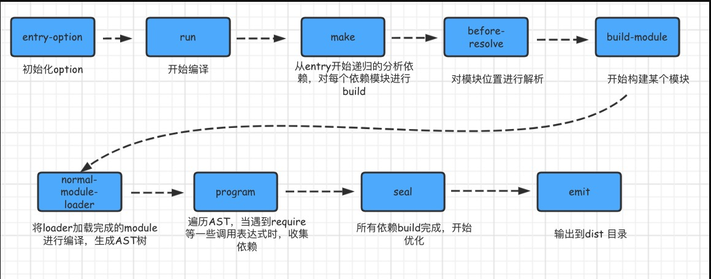
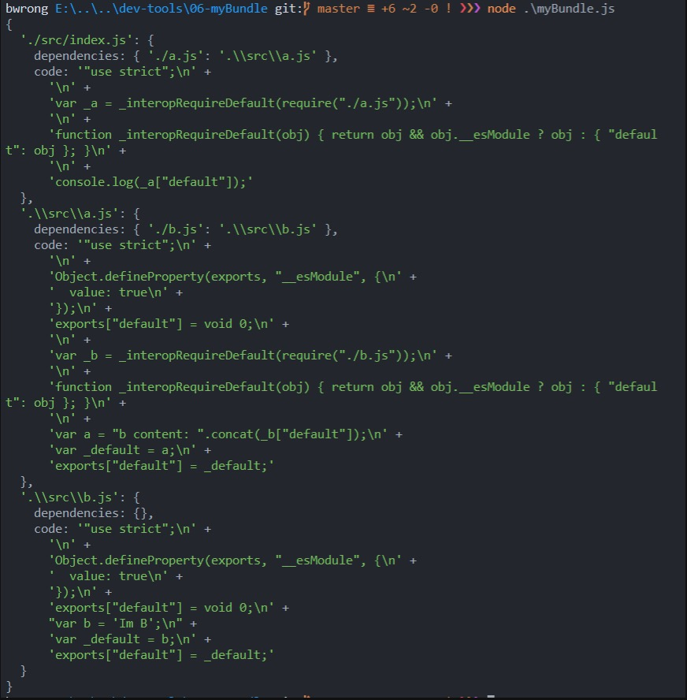

## 构建流程

webpack运行流程是串行方式的，大致如下：



1. **初始化参数：**从配置文件和 Shell 语句中读取与合并参数，得出最终参数；
2. **初始化编译：**用上一步得到的参数初始化 Compiler 对象，加载所有配置的插件，执行对象的 run 方法开始执行编译；
3. **确定入口：**根据配置中的 entry 找出所有的入口文件；
4. **AST & 依赖图：**从入口文件出发，调用 AST 引擎生成抽象语法树 AST，根据 **AST 构建模块的所有依赖**；
5. **递归编译模块：**调用所有配置的 Loader 对模块进行编译，再找出该模块依赖的模块，再递归本步骤直到所有入口依赖的文件都经过了本步骤的处理；
6. **完成模块编译：**在使用 Loader 翻译完所有模块后，得到了每个模块被翻译后的最终内容以及它们之间的依赖关系；
7. **输出资源：**根据入口和模块之间的依赖关系，组装成一个个包含多个模块的 Chunk ，再把每个 Chunk 转换成一个单独的文件加入到输出列表，这步是可以修改输出内容的最后机会；
8. **输出完成：**在确定好输出内容后，根据配置确定输出的路径和文件名，把文件内容写入到文件系统；
9. 在以上的这些过程中，webpack 会在特定的时机广播出对应的事件，方便触发插件中监听了这些事件的钩子运行；

简单来说就是

1. **初始化：**启动构建，读取与合并配置参数，加载 Plugin，实例化 Compiler；
2. **编译：**从 Entry 出发，针对每个 Module 串行调用对应的 Loader 去翻译文件内容，再找到该 Module 依赖的 Module，递归地进行编译处理；
3. **输出：**对编译后的 Module 组合成 Chunk，再把 Chunk 转换成文件，输出到文件系统；

## 核心概念

- **Tapable：**一个基于发布订阅的事件流工具，Compiler 和 Compiliation 对象都继承于 Tapable；
- **Compiler：** 可以理解为webpack编译实例，在webpack启动时被初始化一次全局唯一，它包含了webpack原始配置、Loader、Plugin引用、各种钩子
- **Compiliation：**代表一次 webpack 构建和生成编译资源的过程，在watch 模式下每一次文件变更触发的重新编译都会生成新的 Compiliation 对象，包含了当前编译的模块的 module，编译生成的资源，变化的文件，依赖的状态等；

## 简易版本 webpack

### 模块打包

1. 找到项目入口，并读取其内容；
2. 分析入口文件内容，递归寻找其依赖，生成依赖关系图；
3. 根据生成的依赖关系图，编译并生成最终输出代码；

#### 获取模板内容

```javascript
// index.js
import a from './a.js';
console.log(a);

// a.js
import b from './b.js';
const a = `b content: ${b}`;
export default a;

// b.js
const b = 'Im B';
export default b;
```

```javascript
// myBundle.js
const fs = require('fs')
const getModuleInfo = file => {
    const content = fs.readFileSync(file, 'utf-8')
    console.log(content)
}
getModuleInfo('./src/index.js')
```

#### 查找模块依赖

> 可以通过 @babel/parser 来将代码转换成 AST （抽象语法树），再分析 AST 来查找依赖；

```javascript
// myBundle.js
const fs = require('fs')
const parser = require('@babel/parser')
const getModuleInfo = file => {
    const content = fs.readFileSync(file, 'utf-8')
    const ast = parser.parse(content, {
       sourceType: 'module' // 解析ESModule须配置
    })
    console.log(ast)
    console.log(ast.program.body)
}
getModuleInfo('./src/index.js')
```

转换结果如下：一共可以看到两个 节点 ，type 属性标识了节点的类型， ImportDeclaration 对应了 import 语句，其 source.value 是引入模块的相对路径；


### 生成依赖关系表

将上一步的数据成一份结构化的依赖表，就是遍历 ast.program.body，将其中的 ImportDeclaration 类型的节点提取出来，存入依赖表，使用 @babel/traverse 实现；

```javascript
// myBundle.js
const fs = require('fs')
const path = require('path')
const parser = require('@babel/parser')
const traverse = require('@babel/traverse').default
const getModuleInfo = (file) => {
	const content = fs.readFileSync(file, 'utf-8');
	const ast = parser.parse(content, {
		sourceType: 'module'
	});
  	const dependencies = {}; // 用于存储依赖
    traverse(ast, {
        ImportDeclaration({ node }) { // 只处理ImportDeclaration类型的节点
            const dirname = path.dirname(file);
            const newFile = '.'+ path.sep + path.join(dirname, node.source.value); // 此处将相对路径转化为绝对路径，
            dependencies[node.source.value] = newFile;
        }
  	});
  	console.log(dependencies);
};

getModuleInfo('./src/index.js')
```

输出结果如下：

```javascript
{'./a.js': '.\\src\\a.js'}
```

#### 转换为ES5语法

通过 babel 的工具（@babel/core，@babel/preset-env）将代码转换成ES5的语法；

```javascript
// myBundle.js
const fs = require('fs');
const path = require('path');
const parser = require('@babel/parser');
const traverse = require('@babel/traverse').default;
const babel = require('@babel/core');

const getModuleInfo = (file) => {
	const content = fs.readFileSync(file, 'utf-8');
	const ast = parser.parse(content, {
		sourceType: 'module'
  });
  const dependencies = {};
	traverse(ast, {
		ImportDeclaration({ node }) {
			const dirname = path.dirname(file);
			const newFile = '.'+ path.sep + path.join(dirname, node.source.value);
			dependencies[node.source.value] = newFile; // 使用文件相对路径为key，绝对路径为value
		}
  });
  const { code } = babel.transformFromAst(ast, null, {
		presets: ['@babel/preset-env']
  });
  const moduleInfo = { file, dependencies, code };
  console.log(moduleInfo);
  return moduleInfo;
};

getModuleInfo('./src/index.js');
```

输出如下：


#### 递归寻找依赖

从入口开始，每个模块及其依赖都调用一下 getModuleInfo 方法进行分析，最终就会返回一个完整的依赖图；

```javascript
// myBundle.js
const generDepsGraph = (entry) => {
	const entryModule = getModuleInfo(entry);
	const graphArray = [ entryModule ];
  	// 获取依赖模块对象数组
	for(let i = 0; i < graphArray.length; i++) {
		const item = graphArray[i];
		const { dependencies } = item;
		if(dependencies) {
			for(let j in dependencies) {
				graphArray.push(
					getModuleInfo(dependencies[j])
				);
			}
		}
	}
  	// 返回完整的依赖图
	const graph = {};
	graphArray.forEach(item => {
		graph[item.file] = {
			dependencies: item.dependencies,
			code: item.code
		};
	});
	return graph;
};

```

输出结果如下：



### 生成输出代码

在上面的代码里包含了 export 和 require 这样的 commonjs 的语法，在浏览器是不支持这种语法的，自己实现变两种方法；

```javascript
// myBundle.js
const build = (entry) => {
	const graph = JSON.stringify(generDepsGraph(entry)); 
	return `
		(function(graph){
			function require(module) {				
				var exports = {};				
				return exports;
			};
			require('${entry}')
		})(${graph});
	`;
};

const code = build('./src/index.js');
```

- JSON.stringify 将数据字符串化，否则在下面的立即执行函数中接收到的将是 [ object，object ]，因为是在字符串模块中使用，会发生类型转换；
- 返回的代码包裹在 IIFE 中是防止模块间作用域相互污染；
- require 函数需要定义在输出的内容中，而不是当前的运行环境，因为它会在生成的代码中执行；

接下来，需要拿到入口文件的code，并使用 eval 函数来执行它：

```javascript
// myBundle.js
const build = (entry) => {
	const graph = JSON.stringify(generDepsGraph(entry));
	return `
		(function(graph){
			function require(module) {				
				var exports = {};
				(function(require, exports, code){
					eval(code)
				})(require, exports, graph[module].code);
				return exports;
			};
			require('${entry}')
		})(${graph});
	`;
};

const code = build('./src/index.js');
console.log(code);
```

- 为了防止 code 中的代码和 return 的字符串中作用域有冲突，还是使用 IIFE 包裹，并将需要的参数传递进去；
- graph[module].code 可以从上面的依赖表中获取到入口的代码；

输出如下：


#### 模块路径处理

现在生成的代码中引入模块的方式都是基于'index.js'的相对路径，如果在其他模块引入的模块路径和相较于 index.js 不一致的时候，对应的模块就会找不到，所以还要处理一下模块的路径。前面依赖表的 dependencies  属性里面记录了模块的绝对路径，拿出来使用即可；

```javascript
// myBundle.js
const build = (entry) => {
	const graph = JSON.stringify(generDepsGraph(entry));
	return `
		(function(graph){
			function require(module) {
				function localRequire(relativePath) {
					return require(graph[module].dependencies[relativePath]);
				}
				var exports = {};
				(function(require, exports, code){
					eval(code)
				})(localRequire, exports, graph[module].code);
				return exports;
			};
			require('${entry}')
		})(${graph});
	`;
};

```

#### 代码写入文件

```javascript
// myBundle.js
const code = build('./src/index.js')
fs.mkdirSync('./dist');
fs.writeFileSync('./dist/bundle.js', code);
```