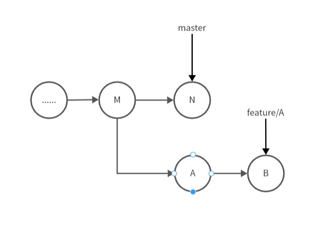
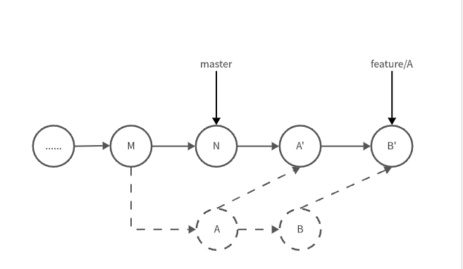

## 基本概念

- **版本库 .git 文件**：.git 文件的作用就是在它创建的时候，会自动创建 master 文件，并且将 HEAD 指针指向 master 分支；
- Git 的四个工作区域：

  - **工作区：**就是本地项目文件，日常在工作区进行开发；
  - **暂存区：** 暂时存放文件的地方，介于工作区和本地仓库之间，主要是标记修改的内容，（通过 add 命令将工作区的文件添加到缓冲区）；
  - **本地仓库（.git）：**一般在项目根目录下有个隐藏目录 `.git` ，使用 commit 命令可以将暂存区的文件添加到本地仓库；
  - **远程仓库：**比如使用 gitHub 托管我们的项目时，它就是一个远程仓库；

- **HEAD：** 指的是当前的快照，当前分支版本顶端（最近一个提交）的别名，这个命令主要配合 reset 的 --hard、--mixed和--soft 对本次修改进行处理：

  - HEAD1：回退一个快照，可以简写 HEAD
  - HEAD~n： 回退 n个快照

- **Staging Index：** 暂存索引，指的是一整套即将被下一个提交的文件的集合，它也可以理解为是即将成为 HEAD 的那个commit
- **Working Copy：**代表正在工作的那个文件集

## Git 仓库中的五个对象

- 三个 blob 对象（保存着文件快照）
- 一个树对象（记录着目录结构和 blob 对象索引）
- 一个提交对象（包含着指向前述树对象的指针和所有提交信息）

**注意：** Git 保存的不是文件级的变化或者差异，而是一系列不同时刻的文件快照

## Git 处理分支的方式

1. commit 操作会为每个目录下的每个文件计算 hash 校验，然后在 Git 仓库里将把这些保存为树对象
2. Git 会创建一个提交对象（commit Object），这个对象会包含一个指向暂存内容快照的指针，还包含了提交的相关息以及指向它的父对象的指针
3. 把当前版本的文件快照保存到 Git 仓库中（使用 blob 对象保存），最终将校验加入到暂存区等待提交
4. 首次产生的提交对象没有父对象，普通提交操作产生的提交对象有一个父对象，由多个分支合并产生的提交对象有多个父对象

## 常见命令&&使用场景

### git stash（储藏）

这个命令算是工作中比较常用的  
比如当前我正在featureA开发新功能，此时我有featureB功能正在交付测试，现在有缺陷提交给我修复但是我在featureA的代码还不能提交，这时候可以

````
git stash //不添加信息直接保存 

git stash save [stashname] // 添加说明 
````

可以使用 `git stash list`  查看  
  
再切回 featureA分支执行

````
git stash pop // 将最近一次的储藏取出来，同时将该暂存从列表中删除

// 指定取出对应的stash 
git stash pop [index]
git stash pop statsh@[index]
````

### 代码回滚场景

#### 未添加到远程仓库

- **在工作区的修改（checkout）：**当文件只在工作区有修改，还没有进行 add 和 commit 操作时，可以使用以下命令来回滚工作区的修改（这种情况被丢弃的内容是不可操作的）

````
git checkout -- [filePath]
````

- **已添加到暂存区的修改（reset）：**如果文件已通过 `git add` 将改动添加到了暂存区，但是还没有 `commit` ，可以使用以下命令来回滚修改（执行该命令回滚后会保留该文件的改动，可以重新编辑进行 add）

````
git reset HEAD [filePath]
````

- **已添加到本地仓库的修改（reset）：**如果文件已经通过 `git commit` 将文件添加到了本地仓库，但是还没有 push，可以使用以下命令来回滚修改

```javascript
git reset <需要回滚的commitId>  // 回滚到某次 commit，但是改动的文件会保留在工作区
git reset -hard <需要回滚的commitId> // 文件不会保留在工作区，会直接丢弃
```

#### 已添加到远程仓库（revert）

如果代码已经提交到远程仓库，应该使用以下命令 `git revert` 进行回滚  
`git reset` 操作是**不会留下记录的，它是直接丢弃回退**的意思，如果对已经push的文件操作可能会产生问题

`git revert`操作用于**回滚之前某次提交内容并生成新的提交**，容易追溯

#### reset 和 revert 的差异

| 命令       | 是否抹掉历史                                                 | 适用场景                                                     | 颗粒度             |
| ---------- | ------------------------------------------------------------ | ------------------------------------------------------------ | ------------------ |
| git reset  | **是**，回滚的历史将消失                                     | 本地提交的改动，但是还未 push 到远端的提交（不介意抹去历史） | 可以作用于特定文件 |
| git revert | **否**，历史提交记录不受影响，回滚后还会生成一次新的提交记录 | 已经提交到远端的改动（需要留痕）                             | 不可作用城文件层面 |

### git reset（回退）

git reset会同时移动 HEAD 和当前分支的指针，说白了它就是重置 HEAD  到之前某一次的commit，所有在该 commit 之后的提交记录会被丢弃！一般用来移除当前分支还未push的一些提交，我还喜欢用来做区间代码review

比如你当前分支master 的提交是这样的：

````
- A - B - C (HEAD, master)
````

HEAD 和 branch tip是在一起的，此时我们希望 master指向 B，那么执行

```javascript
git reset B
// - A - B (HEAD, master) 

// 也可以根据回退xxx次来执行
git reset --hard HEAD~2 (数字代表要回退几个版本)
```

git reset 只是更新一个分支指向另一个 commit （HEAD 和 branch  Tip同时移动保持一致），但是操作后暂存索引和工作目录的状态是由下面这三个命令行选项决定的：

- **--hard：** 直接回退，删除提交记录并不保存所删除记录所做的更改（暂存区和工作区都同步到指定的提交）
- **--soft：** 将 HEAD 到你重置的那个 commit ，index（缓存区）和 working copy（工作区） 都不会有任何变化，所有在HEAD 到重置的 commit 之间的所有变更都放在 **暂存区** 中
- **--mixed：** 默认参数，在该分支上从 original HEAD 到重置的那个 commit 之间的所有变更都保存在工作区中 **（未 staged）**，可以重新修改再做 commit（暂存区和指定的提交同步，工作区不受影响）

### git rebase（变基）

`git rebase` 就是将一个分支的更改基于另一个分支的最新提交进行重新应用，目的就是为了保持整洁的提交历史和线性的提交记录

这个命令一般适用于以下场景：

- **修改已提交的commit message：** 修改错误的提交说明等
- **分支提交混乱，需要梳理：** 多人开发分支提交先后产生冲突，`merge`之后 git 记录呈现树状
- **合并多次修改提交：** 上线打包前，针对某一功能的需求进行提交说明合并（如果是公共仓库或者功能尽量少操作）

#### 合并多条提交记录

```javascript
git rebase -i  [startpoint]  [endpoint]
// 指定的是一个编辑区间（前开后闭），如果不指定 endpoint，终点默认是当前分支 HEAD 所指向的 commit
or
git rebase -i HEAD~2 
// --interactive，即弹出交互式的界面让用户编辑完成合并操作
// 针对没有把commmit push到 远端的情况
```

命令列表翻译一下：

- **pick：** 保留该 commit，缩写 :p
- **reword：** 保留该 commit，但我需要修改该 commit 的注释，缩写 :r
- **edit** ：保留该 commit，但我要停下来修改该提交（不仅仅是修改注释）缩写 :e
- **squash:**  将该 commit 和前一个 commit 合并，缩写 :s
- **fixup：** 将该 commit 和前一个 commit 合并，但我不要保留该提交的注释信息，缩写 :f
- **exec：** 执行 shell 命令，缩写 :x
- **drop：** 我要丢弃该 commit，缩写 :d

编辑跟 linux 的 vim 相似，先输入 i 或者 insert 键，会出现一个插入的标识，然后就可以编辑蓝色区域的命令了

编辑好后按 ESC 再输入 :wq 回车保存，再 push 就可以啦

#### 分支合并（变基）

假设现在A从 master 切出一个 feature/A 分支进行开发，此时 master 最新的提交是 M；

然后B 合了提交 N 到master 分支，此时A 在 feature/A 有两个新提交 A、B

那此时我们的分支线应该是这样的



这个时候我们执行rebase 命令，想要把 master 分支最新的代码合并到 feature/A 分支上

````
git rebase master feature/A
````

此时我们的节点图变成了



在这里，master 分支称为基分支，feature/A 分支称为待变基分支

流程说明：

1. 在feaure/A 分支上执行 rebase 分支时，git 会从 master 和 feature/A 的共同祖先 M 开始提取到 feature/A 分支上的修改 A、B
2. 然后将  feature/A 分支指向 master 的最新提交 N 上

   - 我理解的 rebase 变基就是在这里改变的分支的基底，将 M 改成了新基底N
   - 这里也会有个问题，就是追溯不到 feature/A分支是从哪个分支切出来的

3. 依次处理 N 与 A、B 的冲突，产生新的 A'、B'（注意这里并不是原来在 feature/A 提交的内容），并且删除了原来的提交 A、B

   - 新的 A'、B'会临时保存成 patch 文件，存在 .git/rebase 目录下，所以如果执行了 rebase 操作且没有保存或用 --abort 来终止 rebase 的行动，下次 rebase 会提示当前正在有 rebase 的操作
   - 在处理 N 与 A、B的内容可能会有冲突，这时 git 会停止 rebase 让你解决冲突，使用 `git diff`  查看冲突，手动解决完冲突后，需要执行`git add`去更新这些内容，然后执行 `git rebase -- continue`  就可以了
   - 在任何时候，我们都可以用 git rebase --abort 来终止 rebase 的行动，并且分支会回到 rebase 开始前的状态


### 找回已删除内容

`git reflog` 可以找回被 reset 丢掉的 commit 、被删掉的分支等，但下面这些情况的“删除”，这个命令也是“无能为力”：

- **非本地操作：** git reflog 能管理的是本地工作区的操作记录，如果是其他他或者其他机器上操作的记录它就没辙了
- **未 commit ：** 如果是在 工作区或者暂存区就被回滚的内容（未被 commit），这种类型也是不能处理
- **“超时”：** git reflog 保留的记录有时间限制（默认 90 天），超时的会被自动清理，或者开发者自己主动执行清理命令也会提前清理掉

#### 找回本地误删除的分支

当我们使用 `git branch -D xx`  删除本地分支后，发现删错了，

这个时候可以通过 reflog 找到分支被删前的 commit，基于目标 commit 重建分支

````
git branch <分支名> <目标commit>
````

#### 找回合流后删除的分支(branch)

一般我们在开发新功能会在新分支上，合并master上线后就会删除对应分支  
如果我们需要重建已经合并的分支，可以通过提交记录找到对应的分支节点，基于该 commit 再新建分支

````
git branch {目标分支} {commitId}
````

### 恢复特定 commit 中的某个文件（checkout）

````
git checkout <目标 commit> -- <文件>
````

### 修改提交信息

#### 修改最近一次的提交

- **交互式修改** ：输入命令： `git commit --amend` ，会进入对最后一次提交信息编辑的 vim 编辑器界进行修改
- **命令直接修改** ：

```git
git commit --amend --message="new commit message"
git commit --amend --author="xxx@xx.com"
```

【如果修改是已经提交到远程仓库的 commit 信息】上面两种方式都必须要用 `git push --force` 将修改提交到远程仓库，不然会报错

#### 修改最近两个或者两次以上的 commit 信息

如果要修改之前某一次或多次提交的 commit 信息，就要用到 git rebase 的功能了：

`git rebase -i HEAD~｛N｝` ，其中 N 表示最近 N 次的提交

## 忽略文件 .gitignore

> 这个文件会去忽略一些不需要纳入 Git 管理、也不希望出现在未跟踪文件列表；

一般在项目中不需要提交到远端的一些文件，可以在 .gitignore 文件中进行说明，拒绝 git 文件跟踪

```javascript
# 此行为注释 会被Git忽略

# 忽略 node_modules/ 目录下所有的文件
node_modules

# 忽略所有.vscode结尾的文件
.vscode

# 忽略所有.md结尾的文件
*.md

# 但README.md 除外
!README.md

# /* 或者 * 表示目录下全部排除 
doc/*.txt 

# 忽略 doc/ 目录下所有扩展名为txt文件
doc/**/*.txt

```

但是如果之前你的文件或者文件夹已经提交过到远端，此时已经被git追踪，就算在.gitignore 文件中声明，在后续改动还是会被继续追踪  
这种情况只需要将本地的缓存进行清理，让文件变成untracked 的状态就好了

```javascript
// 将删除的文件夹添加到Git 的忽略列表中，然后再进行add和commit 
git rm -r -cached /dist
```