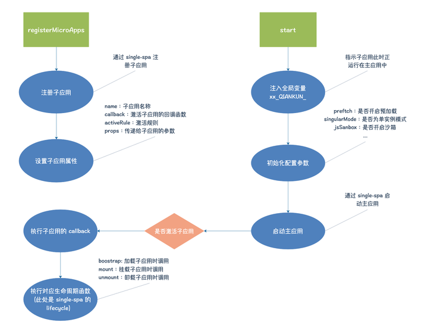

先说一下微前端的好处吧：接入项目与使用栈无关，可以在一个项目里使用不同的技术栈开发并相互独立&独立运行

听着好像很不错的样子，但是经我个人使用经验来说，不用盲目看着好处就冲微前端，主要还是看本身的业务需求和定位：

- 如果只是暂时的项目技术栈版本全面升级啥的也不比用这个，就老实迁移完事
- 如果是一个古早项目你的确想要介入新项目并且之前的代码不动也不迁移了，那可以考虑微前端方式介入

## iframe

iframe算是很古早的一种项目嵌入子应用的方式，而且很快速也很方便，也不需要配置那么多七七八八的配置

iframe的特点：

- 自带样式、环境隔离机制，具备天然的沙盒机制；
- iframe功能之间的跳转后页面不会刷新url，导致刷新状态或者浏览器前进后退功能无法使用；
- 模态窗的背景是无法覆盖到整个应用的：这个问题我是通过子应用和主应用进行通信，在主应用上同步弹出layout的灰色遮罩做的
- iframe应用加载失败，主应用是无法感知的

### 应用通信

只要iframe来自同一个源，可以使用 Window.postMessage来进行消息传递

## qiankun

由蚂蚁金服推出的一个基于Single-Spa实现的一个前端微服务框架，其本质还是**路由分发式**的框架，它是采用的 **HTML Entry** 方式进行了替代优化

Single-Spa 采用 JS Entry 加载子应用的方案，但是 JS Entry 的使用是由要求限制的：

- 限制一个 JS 入口文件
- 图片、css等静态资源是需要打包到 JS 里
- Code Splitting 无法应用

HTML Entry 只要在项目配置里确定好入口文件，qiankun 自动会请求资源解析出JS和CSS，插入到指定的容器中

### 基座应用改造

qiankun 只需要在基座项目中引用， 你可以新创建一个项目作为基座或者在你原有的项目上进行改造，在此基础上单独为子应用提供一个挂载的容器div，填充在相应的内容展示区域

- 为了方便维护管理，可以现在项目中新建一个micro的目录，里面放微前端改造的代码

### 路由配置文件

这里要注意如果主应用项目是 hash模式路由，子应用的路由模式必须和主应用一致，否则会加载异常；因为如果主应用跳转路由改变了pathname，那么很难再匹配到子应用

```javascript
// 路由配置
const apps = [
  {
    name: 'ReactMicroApp',
    entry: '//localhost:10100',
    container: '#qiankun',
    activeRule: '/react'
  }
];
```

### 应用配置注册函数

```javascript
import { registerMicroApps, start } from "qiankun";
import apps from "./apps";

// 注册子应用函数，包装成高阶函数，方便后期如果有参数注入修改app配置
export const registerApp = () => registerMicroApps(apps);

// 导出 qiankun 的启动函数
export default start;
```


### 修改Layout 组件

```javascript
<section class="app-main">
  <transition v-show="$route.name" name="fade-transform" mode="out-in">
    <!-- 原主应用渲染区，用于挂载主应用路由触发的组件 -->
    <router-view /> 
  </transition>

  <!-- 子应用渲染区，用于挂载子应用节点 -->
  <div id="qiankun" />
</section>

import startQiankun, { registerApp } from "../../../micro";
export default {
  name: "AppMain",
  mounted() {
    // 初始化配置，注意这里是要在mounted里面进行初始化，保证挂载容器一定存在
    registerApp();
    startQiankun();
  },
};
```


### qiankun注册子应用

- 依赖注入后，会先初始化标识变量参数 xx_QIANKUN_，用来判断所处环境等
- 当 qiankun 会通过 activeRule 的规则来判断是否激活子应用

  - activeRule 为字符串时，以路由拦截方式进行自主拦截（比如你有一个子应用全部以/sub开头）
  - activeRule 为函数时，根据函数返回值判断是否激活

- 当激活子应用时，会通过 HTML-Entry 来解析子应用静态资源地址，挂载到对应容器上
- 创建沙箱环境，查找子应用生命周期函数，初始化子应用



### 创建qiankun子应用

比如我们通过create-react-app创建了一个react项目应用，那么在子应用我们就需要向外暴露一系列生命周期函数给qiankun调用，所以需要先改index文件

### 增加publicPath.js

当子应用挂载在主应用下时，如果我们的一些静态资源沿用了 `publicPath=/` 的配置，我们拿到的域名将会是主应用域名，这个时候就会造成资源加载出错，Webpack 提供了修改方法:

```javascript
if (window.__POWERED_BY_QIANKUN__) {
  __webpack_public_path__ = window.__INJECTED_PUBLIC_PATH_BY_QIANKUN__;
}
```

### 路由 base 设置

因为通常来说，主应用会拦截浏览器路由变化以激活加载子应用；

比如在主应用我们的路由配置，激活规则写了 `activeRule: /sub`，当浏览器 `pathname` 匹配到 `/sub` 时，会激活子应用，但是如果我们的子应用路由配置是下面这样的：

```javascript
<Router>     
  <Route exact path="/" component={Home} />
  <Route path="/list" component={List} />  
</Router>   
```

这里需要判断是否在 qiankun 环境下，调整下 base 即可，如下：

```javascript
const BASE_NAME = window.__POWERED_BY_QIANKUN__ ? "/react" : "";
...
<Router base={BASE_NAME}>
...
</Router>     
```

### 增加生命周期函数

子应用的入口文件加入生命周期函数初始化，方便主应用调用资源完成后按应用名称调用子应用的生命周期，注意这里声明的所有声明周期都必须是 Promise

通常我们可以在这里做一些全局变量的初始化，比如不会在 unmount 阶段被销毁的应用级别的缓存等

```javascript

/**
 * 应用每次进入都会调用 mount 方法，通常我们在这里触发应用的渲染方法
 */
export async function mount(props) {
  console.log("mount", props);
  render(props);
}

/**
 * 应用每次切出/卸载 会调用的方法，通常在这里我们会卸载微应用的应用实例
 */
export async function unmount() {
  console.log("unmount");
  ReactDOM.unmountComponentAtNode(document.getElementById("root"));
}
```

### 修改打包配置

配置的修改为了达到两个目的：一个是暴露生命周期函数给主应用调用，第二点是允许跨域访问

- **暴露生命周期：** UMD 可以让 qiankun 按应用名称匹配到生命周期函数
- **跨域配置：** 主应用是通过 Fetch 获取资源，所以为了解决跨域问题，必须设置允许跨域访问

```javascript
module.exports = {
  webpack: (config) => {
    // 微应用的包名，这里与主应用中注册的微应用名称一致
    config.output.library = `ReactMicroApp`;
    // 将你的 library 暴露为所有的模块定义下都可运行的方式
    config.output.libraryTarget = "umd";
    // 按需加载相关，设置为 webpackJsonp_ReactMicroApp 即可
    config.output.jsonpFunction = `webpackJsonp_ReactMicroApp`;

    config.resolve.alias = {
      ...config.resolve.alias,
      "@": path.resolve(__dirname, "src"),
    };
    return config;
  },

  devServer: function (configFunction) {
    return function (proxy, allowedHost) {
      const config = configFunction(proxy, allowedHost);
      // 关闭主机检查，使微应用可以被 fetch
      config.disableHostCheck = true;
      // 配置跨域请求头，解决开发环境的跨域问题
      config.headers = {
        "Access-Control-Allow-Origin": "*",
      };
      // 配置 history 模式
      config.historyApiFallback = true;

      return config;
    };
  },
};
```

跳转流程梳理：在主应用 router 中定义子应用跳转 path ：

- 在调用组件 mounted 生命周期中使用 qiankun 暴露的 loadMicroApp 方法加载子应用，跳转到子应用定义的路由；
- 同时使用 addGlobalUncaughtErrorHandler 和 removeGlobalUncaughtErrorHandler 监听并处理异常情况（例如子应用加载失败）
- 当子应用监听到跳转路由时，加载子应用定义的 component，完成主应用到子应用的跳转


### 需要注意的点

- **css样式混乱：**默认情况下 qiankun 并不会开启 CSS 沙箱进行样式隔离，可以启用 { strictStyleIsolation: true } 配置开启严格隔离样式，这个时候会用 Shadow Dom 节点包裹子应用 配置开启严格隔离样式
- 为千吨
- **跨域的问题：**部署上有点繁琐，需要手动解决跨域问题

## monorepo

这个后面再写吧