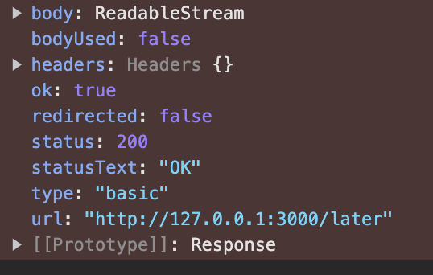

> ajax 实现向服务器发送数据接受数据而页面不刷新，可以理解为是前后端交互的一种技术

XMLHttpRequest 是浏览器提供的一个api，也就是一个构造函数，ajax 就是基于XMLHttpRequest 模块实现的

```javascript
const xhr = new XMLHttpRequest()
xhr.onreadystatechange = () => {
  if (xhr.readyState !== 4) return

  if ((xhr.status >= 200 && xhr.status < 300) || xhr.status == 304) {
    alert(xhr.responseText)
  } else {
    alert(xhr.status)
  }
}
xhr.open('GET', url, true)
xhr.send(null)
```

## readystate

> readystate 为实例的属性；

status为响应状态码（http状态），和 readystate 不同；

1. 0：未初始化 -- 尚未调用.open() 方法；
2. 1：启动 -- 已经调用.open() 方法，但尚未调用.send()方法；
3. 2：发送 -- 已经调用.send()方法，但尚未接收到响应；
4. 3：接收 -- 已经接收到部分响应数据；
5. 4：完成 -- 已经接收到全部响应数据，而且已经可以在客户端使用；

## 取消异步

> ajax也可以取消事件监听,将异步改为同步，调用 abort()；

## progress进度

每个请求都从触发 loadstart 事件开始，接下来，通常每隔 50 毫秒左右触发一次 progress 事件，然后触发 load、error、abort 或者 timeout 事件中的一个，最后以触发 loaded 事件结束；

1. loadstart：在接收到响应数据的第一个字节时触发；
2. progress：在接收响应期间持续不断地触发；
3. error：在请求发生错误时触发；
4. abort：在因为调用abort()方法而终止连接时触发；
5. load：在接收到完整的响应数据时触发；
6. loadend：在通信完成或者触发error，abort或load事件后触发；
7. timeout：超时发生时触发；

```javascript
var xhr;
if(window.XMLHttpRequest){
    xhr = new XMLHttpRequest();
}else{
    xhr = new ActiveXObject('Microsoft.XMLHTTP');
}
//进度事件
xhr.onprogress = function(e){
    e = e || event;
    if (e.lengthComputable){
        result.innerHTML = "Received " + e.loaded + " of " + e.total + " bytes";
    }
};
xhr.onload = function(e){
    var data = xhr.response;
    e = e || event;
    if(xhr.status == 200){
        var audio = document.createElement('audio');
        audio.onload = function(){
            URL.revokeObjectURL(audio.src);
        }
        audio.src = URL.createObjectURL(data);
        audio.setAttribute('controls','');
        if(!music.innerHTML){
            music.appendChild(audio);
        }
    }
};
//发送请求
xhr.open('get','xxx.mp3',true);
xhr.responseType = 'blob';
xhr.send();
```


## fetch
> fetch 是Es6 出现的，基于 promise，比 xhr 用起来会更简洁一点，它是为了取代xhr而诞生的
```
fetch(url, config)
```
### 配置文件
```
{
method: 'GET', //请求使用的方法，如GET、POST。
headers:{}, // 请求的头信息。
body: {}, // 请求的body信息：可能是一个Blob、BufferSource、FormData、URLSearchParams或者USVString对象，注意GET或HEAD方法的请求不能包含body信息。
mode: '', 请求的模式，如cors、no-cors或者same-origin。
credentials:'', // 请求的credentials，如omit、same-origin或者include，为了在当前域名内自动发送cookie，必须提供这个选项。
cache:'', 请求的cache模式: default、no-store、reload、no-cache、force-cache或者only-if-cached。
redirect:'', // 可用的redirect模式: follow自动重定向，error如果产生重定向将自动终止并且抛出一个错误，或者manual手动处理重定向。
referrer: '', // 一个USVString可以是no-referrer、client或一个URL，默认是 client。
referrerPolicy:  指定了HTTP头部referer字段的值，可能为以下值之一： no-referrer、no-referrer-when-downgrade、origin、origin-when-cross-origin、unsafe-url。
integrity: 包括请求的subresource integrity值，例如: sha256-BpfBw7ivV8q2jLiT13fxDYAe2tJllusRSZ273h2nFSE=
}
```
### 返回值

主要注意下面几个字段

1. 
https://www.cnblogs.com/WindrunnerMax/p/13024711.html